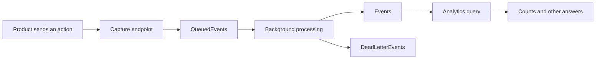

# The big picture, three ways

**Keep one sentence:** Pulse accepts activity, processes it, and answers
questions about it.

## Way 1: a product story

Mara runs a small online shop. Her shop sends Pulse a `pageview` event when
a visitor opens the pricing page. Later Mara asks how many visits happened.
Pulse stores the activity and calculates the answer.

Mara's management account is a **User**. The visitor being measured is a
**Person**. The shop's analytics workspace is a **Project**.

## Way 2: a mailroom analogy

| Mailroom picture | Actual codebase idea |
| --- | --- |
| A labeled customer's tray | Project-scoped data |
| Reception accepts a work slip | `/capture` validates and queues an event |
| A durable pending-work ledger | `QueuedEvents` database table |
| A bell says there may be work | `IngestionSignal` |
| A worker handles the slip | `IngestionWorker` and `IngestionProcessor` |
| Completed records can be counted | `Events` queried by `QueryService` |
| A problem tray preserves failed work | `DeadLetterEvents` |

The bell is not the work slip. In code, the channel carries a boolean wake-up
signal, while the event payload lives in the database.

The analogy has limits: there is no separate mailroom server here. The HTTP
app and its background workers normally run in the same application process.
And unlike a perfect first-in-first-out line, later events can overtake retries.

## Way 3: a diagram

Plain-text version: `product -> capture -> queue -> worker -> events -> query`.
Processing can also end in a dead letter.

## Repeat the central distinction

"Accepted" means the work was queued. "Processed" means the worker stored
the event. The worker may finish quickly, even before you inspect the response,
but `202` promises acceptance rather than successful completion.

**Try:** point to the diagram box that can contain work after a process
restart. Then point to the box a trend query reads.

Answer

Committed queue rows survive ordinary application restart because they are
in the database. Trend queries read processed events, not pending queue rows.

Next: [find these boxes in the repository](03-repository-map.md).
