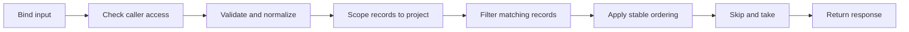

# Session 2 — Make a small API change correctly

Stories: US-07–US-25. The implementation adds validation, project rename,
optional list filters, deterministic paging, a person count, and dead-letter
detail. [JuniorApiStoriesTests](../../tests/Pulse.Tests/Api/JuniorApiStoriesTests.cs)
contains behavior examples; consult [the ledger](stories.json) for actual results.

## A request is a sequence of decisions



Framework binding can reject malformed booleans or timestamps before a handler
runs. Your own domain validation belongs after the existing access guard.
Otherwise a caller might learn details about a project they cannot see.

Open [InputRules](../../src/Pulse.Api/Endpoints/InputRules.cs). It provides two
small repeated operations: trimming/length validation and named-choice validation.
It does not decide project permissions or execute queries. Keeping it small
makes reuse understandable; a generic validation framework would be unnecessary
for these few contracts.

## Filter before paging: calculate the result yourself

Suppose projects in creation order are Other, Needle A, Other Two, Needle B.
You ask for matching names containing Needle, limit 1, offset 1. Filtering
first gives Needle A and Needle B; skipping one returns Needle B. Paging the
unfiltered list first would return Needle A and then filter that single result.
Both responses can look plausible, but only one honors the requested contract.

[ProjectEndpoints](../../src/Pulse.Api/Endpoints/ProjectEndpoints.cs) builds an
IQueryable, adds the name predicate, applies the selected ordering, then
materializes a page. Until ToListAsync, these operations describe a database
query; they are not a loop over already downloaded projects.

Timestamp ordering alone is insufficient when rows share a timestamp. The
additional ID ordering makes the page order deterministic for unchanged data.
Offset paging still is not a snapshot: concurrent insertions can shift offsets.
Later cursor stories address a different continuation contract.

## Similar-looking strings have different rules

Substring filters are literal and case-sensitive. A percent sign searches for
the percent character; it is not an invitation to construct raw SQL LIKE text.
Event-name and flag-key prefixes use ASCII case-insensitive normalization.
The stored names/keys retain their original spelling. Member email search uses
the account system's lowercased email convention.

Always document the rule. "Search" alone does not tell a caller whether matching
is exact, prefix, substring, case-sensitive, or interpreted as a pattern.
The tests deliberately use `%`, mixed case, and empty/overlong input to reveal
those differences against real SQLite.

## Dates: draw the interval

Person creation filtering uses `[createdFrom, createdBefore)`: include the start,
exclude the end. Adjacent windows can meet without counting their shared
boundary twice. It filters Person.CreatedAt, not the timestamp on an event.

Annotation dates and synchronous export ranges retain their existing inclusive
end behavior. Reversed ranges now return a useful validation problem. Equal
annotation dates remain valid; equal person start/end bounds are invalid
because that contract requires a nonempty half-open range.

The lesson is not that one interval convention always wins. Preserve and
explain the convention of the specific feature, and test the exact boundary.

## Validate the whole update before assigning anything

An annotation update can contain a valid new date and an invalid long text.
The handler validates text before assigning either field. The test reloads
the original date after rejection. That check protects observable behavior;
asserting only HTTP 400 could miss a partially saved update.

Project rename follows the same principle and deliberately assigns only Name.
The test verifies unchanged project ID, keys, and CreatedAt. A convenient whole
object copy from the request would make accidental field changes easier.

## One person is not one alias

[PersonEndpoints](../../src/Pulse.Api/Endpoints/PersonEndpoints.cs) uses an Any
predicate over distinct-ID mappings rather than a join that multiplies returned
person rows. Count queries count Persons, not Events or management Users.
Three captured events with identities A, A, B should produce two people.

Explain the same idea as a library: one reader may have an old and new library
card. Counting cards answers a different question from counting readers.

## Testing as a worked example

The new integration class uses a fresh account/project for each scenario.
Exact timestamps are assigned in an isolated database scope; no sleeps are used
to force creation order. API requests exercise binding, authentication, query
translation, and response serialization together.

```powershell
dotnet test tests/Pulse.Tests/Pulse.Tests.csproj --filter FullyQualifiedName~JuniorApiStoriesTests
```

If dotnet is absent from this shell's PATH but installed at the session's known
location, use `& 'C:/Users/E/.dotnet/dotnet.exe'` in its place. A missing executable
is an environment issue; a failed assertion after the host starts is different
evidence. Record which occurred rather than calling both "tests failed."

## Practice and recall

1. Draw the SQL operation order for a filtered dead-letter page. Explain why
   searching payload text would violate the errorContains contract.
2. Predict the person count after adding a second alias to an existing person.
3. Describe the difference between an active flag and a flag that evaluates
   true for one identity. A 0% active flag is a useful counterexample.
4. Trace the same-owner foreign-project fixture: why does authentication alone
   fail to protect the query from a missing ProjectId predicate?
5. Pick an invalid update and explain how the test proves no partial mutation.

Repeat these questions with a different endpoint tomorrow. The transferable
skill is defining the contract and identifying the database operation that
actually enforces it.
