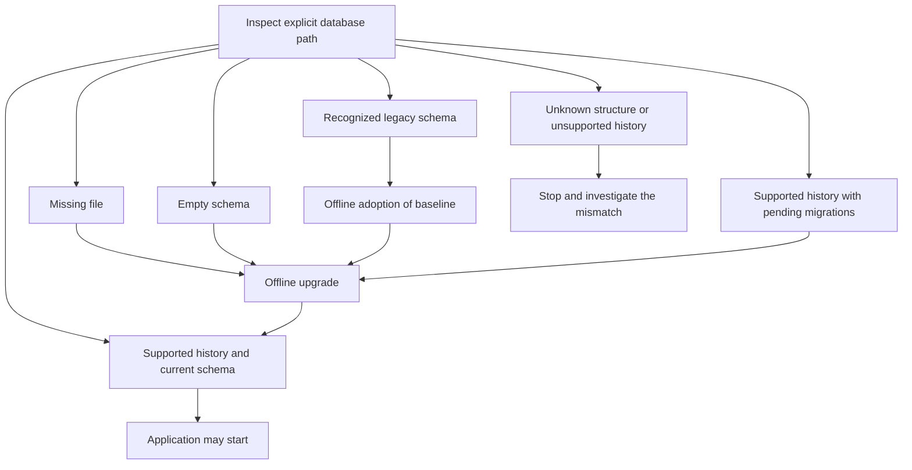

# Session 3: Change a database without losing its history

This session accompanies SR-01. Consult the journal and story ledger for the
current implementation and verification status before running maintenance.

## Start with the problem in ordinary language

An existing Pulse installation already has projects, people, events, queued
work, and keys. Adding a column to a C# class does not add that column to its
database. Recreating the database would discard the very information the
feature should preserve. We need an ordered set of changes and evidence that
we are starting from a supported structure.

Think of renovating an occupied house. The current database is the house, the
entity model is the desired floor plan, and a migration is an ordered work
instruction. A migration-history table is the record of completed work. Writing
"renovation complete" into that record without inspecting the house does not
make it true.

In code terms: EF's model describes the application-facing structure; migration
classes describe transitions; `__EFMigrationsHistory` records applied migration
identifiers. None of these alone proves that an arbitrary SQLite file matches
what the application expects.

EF documents that `EnsureCreated` and migrations serve different initialization
paths; SQLite also has provider-specific migration and lock limitations. See
[database creation guidance](https://learn.microsoft.com/en-us/ef/core/managing-schemas/ensure-created)
and [SQLite limitations](https://learn.microsoft.com/en-us/ef/core/providers/sqlite/limitations).
The adoption check here is repository-specific code, not an EF built-in command.

## Follow one decision through the code

Read these files in order:

1. [DatabaseCommands](../../src/Pulse.Api/Database/DatabaseCommands.cs) selects
   the explicit maintenance operation and database path before a web host starts.
2. [DatabaseLifecycle](../../src/Pulse.Infrastructure/Schema/DatabaseLifecycle.cs)
   classifies the database and decides which transitions are permitted.
3. [SchemaInspector](../../src/Pulse.Infrastructure/Schema/SchemaInspector.cs)
   describes tables, columns, foreign keys, and indexes using SQLite metadata.
4. [DatabaseUpgradeTests](../../tests/Pulse.Tests/Infrastructure/DatabaseUpgradeTests.cs)
   gives each scenario a separate disposable database file.

Pause after each file. Say what it owns in one sentence. The command owns
operator input; the lifecycle owns transition policy; the inspector owns
structural evidence; the tests own reproducible examples of those promises.

## Draw the states before memorizing methods

Adoption and upgrade answer different questions. Adoption says, "this existing
structure matches the historical baseline." Upgrade says, "apply the remaining
known transitions." A legacy file needs the first answer before the second.

## Why compare metadata instead of SQL text?

Two `CREATE TABLE` statements can differ in whitespace while defining the same
columns. Conversely, two tables with the same name can have different nullability,
keys, or indexes. The inspector normalizes structural metadata and compares it
with a temporary database created from the recorded migration version.

Notice which values matter. An index's name, uniqueness, and columns matter.
The order SQLite happens to enumerate indexes does not. Ignoring enumeration
order is normalization; ignoring an unexpected trigger would hide a material
schema difference. Read the implementation and identify one example of each.

## Why inspect again while holding a write lock?

Suppose process A checks the schema, process B changes it, and process A then
writes a baseline-history row. A's evidence is stale. Adoption takes a SQLite
write transaction before checking and recording the baseline, so another writer
cannot slip a change between those operations. This is a small example of a
general concurrency rule: protect the interval between a check and the write
whose correctness depends on that check.

The operational procedure still requires stopping application writers. A lock
protects a transaction; it does not coordinate a whole deployment or make old
application binaries compatible with a new schema.

## Practice using disposable files

1. Read the fresh-database test. Predict whether status, adoption, or upgrade
   should create a missing file. Explain why a read-only status operation should
   not create one as a side effect.
2. Read the frozen legacy SQL fixture. Find `Projects`, `Events`, and
   `QueuedEvents`. Trace one seeded row from the preservation test through
   adoption and upgrade.
3. Add an extra table to a copy in a test. Predict the resulting state and
   whether migration history should appear after rejected adoption.
4. Compare a file's bytes before and after read-only inspection. This checks
   a different promise from merely asserting that the reported state is right.
5. Read the backup-copy test. Explain why upgrading the copy and proving the
   original still has its legacy state is useful recovery evidence.

Never use your only working database as an exercise fixture. A useful fixture
can be recreated from source and contains deliberately chosen, non-secret data.

## Teach it back at three levels

**To a new teammate:** we check the old database, record a recognized starting
point, and apply known changes while preserving the rows.

**To a reviewer:** startup verifies schema/history agreement; the offline command
adopts an exact baseline under a write transaction; migrations handle subsequent
changes; tests exercise fresh, legacy, repeated, unknown, and restored files.

**To an operator:** stop writers, make a recoverable copy, inspect the explicit
path, follow the indicated adoption/upgrade operation, verify status, then start
the application. Use the tested runbook and the version of the application that
owns those migrations.

## What would convince you this is finished?

Successful compilation is only the first gate. You need fresh creation, legacy
row preservation, repeatability, rejection of unknown structures, read-only
inspection, and an actual supported upgrade path as later migrations arrive.
Also check the ordinary test host: changing startup can break every API test
even when the lifecycle unit tests pass. Record exactly which checks ran and
which failed instead of turning "code exists" into "upgrade is safe."
