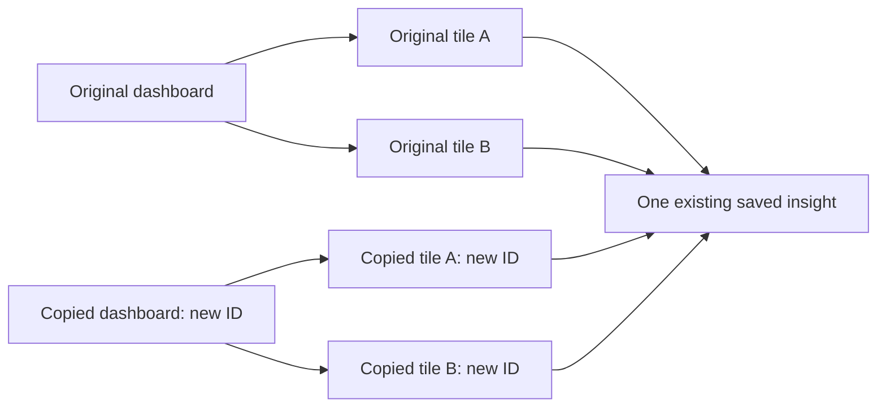

# Session 4: One dashboard, several kinds of ownership

This session accompanies MID-01, MID-03, and MID-04. Use the journal and ledger
to see which checks have passed. The code examples below explain the implemented
design; the integration tests are the executable evidence for its contracts.

## Begin with three concrete requests

You have a dashboard called Growth. Two tiles show the same saved signup query
with different positions. A third shows an activation funnel.

1. Duplicate Growth as Growth experiments. You want to rearrange the copy while
   keeping the original layout available.
2. Drag two tiles, then save both positions together. If one position is invalid,
   neither position should change.
3. Refresh the two signup tiles. You need two tile entries in the response, but
   the same query only needs to execute once within this request.

These operations look similar in a UI. They have different correctness rules.
The useful midlevel skill is naming each rule before selecting an implementation.

## Draw the references before copying objects



The new dashboard owns new tile rows. All four tiles point to one insight. Moving
a copied tile changes its own `LayoutJson`. Editing the shared insight changes
the query used by both dashboards. That is the promised behavior of duplication.

Another way to say it: copying a bookmark creates a new bookmark, not a new copy
of the website. Here the tile is the bookmark and the insight is its destination.
Unlike that analogy, the database also needs project ownership checks: a GUID
identifying an insight does not authorize access to it.

Read [DashboardCopyService](../../src/Pulse.Infrastructure/Services/DashboardCopyService.cs).
Find the project-scoped source lookup, the maximum of 101 loaded tiles, and the
distinct insight ID list. Loading 101 detects a source exceeding the limit of
100 without loading an unbounded dashboard. Comparing the complete insight set
prevents an inner join from silently erasing broken tiles from the copy.

**Predict before running:** a source with two tiles sharing one insight produces
one dashboard row, two tile rows, and zero insight rows. A source with a foreign
insight reference produces zero new rows and a 409 response.

## Validate the entire batch before changing tracked entities

The strict layout endpoint accepts:

```json
{
  "tiles": [
    {"tileId": "replace-with-first-tile-id", "layout": {"x": 0, "y": 0, "w": 6, "h": 3}},
    {"tileId": "replace-with-second-tile-id", "layout": {"x": 6, "y": 0, "w": 6, "h": 3, "color": "green"}}
  ]
}
```

Use real GUIDs from your dashboard response. The grid is 12 columns wide.
`x + w = 12` fits exactly; `x + w = 13` does not. Additional fields survive
because the complete validated JSON object is stored. Overlap is permitted.
The existing single-tile update remains the more general JSON layout operation.

Trace [DashboardCompositionEndpoints](../../src/Pulse.Api/Endpoints/DashboardCompositionEndpoints.cs):

1. Authenticate project membership.
2. Check collection size, unique IDs, objects, integer coordinates, and bounds.
3. Build a temporary ID-to-layout map. No tracked tile has changed yet.
4. Begin a transaction; verify the dashboard and complete requested tile set.
5. Assign all validated layouts; save once and commit.

An invalid coordinate is a 400. A tile outside the requested dashboard is a
generic 404. Both leave all requested layouts unchanged. Keeping validation
separate from assignment makes this easier to review, while the transaction
protects the persistence boundary.

**Repeat the idea using a different example:** submitting nine valid addresses
and one invalid address can save zero addresses when the product promise is
"replace this entire delivery plan together." A batch endpoint does not
automatically imply partial success; the contract must choose the behavior.

Concurrent successful layout saves use the last committed layout for an
overlapping tile. Atomicity inside one request does not detect competing edits.
Later concurrency stories teach a separate version-checking contract.

## Reuse a computation without reusing the tile

The selected refresh endpoint accepts 1–50 unique tile IDs. It resolves every
requested tile before executing queries, then iterates in the caller's order.
Its dictionary maps insight ID to execution result and exists only inside the
request. Two tiles retain their own IDs and layouts while sharing that result.

The scope of the dictionary is part of the feature. A second HTTP request runs
the query again, so new events can appear. A global dictionary would introduce
an invalidation problem and could return stale results. Parallel tasks on the
same scoped DbContext would introduce a separate thread-safety problem. Neither
is needed to deliver this request-level reuse.

A broken stored query produces a tile error while healthy tiles still return
results. A missing or foreign insight reference produces an unavailable-insight
error without disclosing its name. Cancellation still propagates; it does not
become an apparently successful refresh response.

## Read tests as small product specifications

Open [DashboardCompositionTests](../../tests/Pulse.Tests/Api/DashboardCompositionTests.cs).
The fixtures deliberately include shared insights, foreign rows, extra JSON
fields, boundary coordinates, and invalid selections. Each detail represents a
plausible mistake the implementation must resist.

The counting runner wraps the real runner. It observes executions while retaining
real database queries and HTTP responses. One request containing two tiles sharing
an insight increments the count once; a second request increments it again.
A missing selected tile leaves the count unchanged. This tests behavior that
matching response JSON alone cannot prove.

Run the focused class from the repository root:

```powershell
dotnet test --filter FullyQualifiedName~DashboardCompositionTests
```

Also run the existing `DashboardTests` before declaring compatibility. A new
endpoint passing does not establish that the original refresh still works.

## Practice and teach back

1. Copy a two-tile dashboard. List which IDs changed and which stayed equal.
2. Move one copied tile and reload both dashboards. Explain the result using
   entity references rather than the visual resemblance of the dashboards.
3. Submit one valid and one out-of-bounds grid position. Predict the HTTP status
   and the database state before inspecting them.
4. Reverse the selected tile IDs. Explain why result order follows the request
   even if the database returned rows in a different order.
5. Compare all-or-nothing layout saves with per-tile refresh errors. Explain why
   the two endpoints intentionally have different failure policies.

**Review question:** point to the exact check, transaction, or dictionary that
enforces each promise. If you cannot connect a promise to code and a test, the
feature is not yet understood well enough to maintain confidently.
