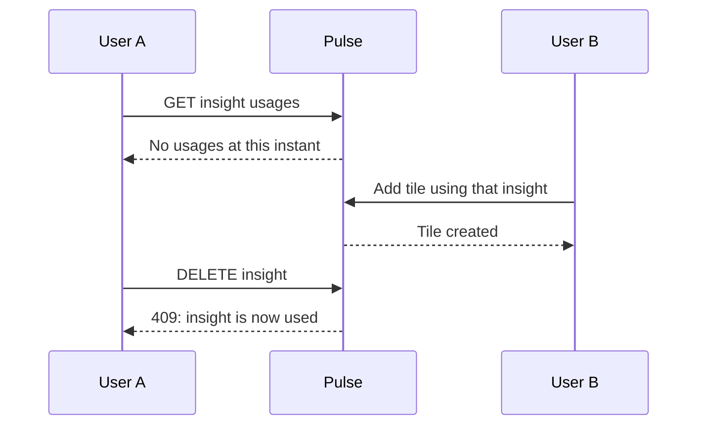

# Session 5: A saved query is a recipe, not its result

This session follows MID-05 through MID-07: previewing, replacing, finding usages,
and deleting insights. Check the ledger for current verification status.

## Use one example throughout

Your saved insight says: count `signup` events over the last 30 days. Two
dashboards reference it. Yesterday you exported its result to a completed file.
Today you change the insight to count `activate` events.

The next dashboard refresh uses `activate`. Yesterday's completed download
keeps the bytes it already stored. A pending export uses the configuration its
worker reads when it executes. These outcomes follow from what each record
stores, not from what its name sounds like.

| Record | What it stores | Effect of editing the insight |
| --- | --- | --- |
| Insight | A type and query configuration | The recipe changes |
| Dashboard tile | An insight ID and layout | The next refresh follows the same ID to the new recipe |
| Completed export | A rendered document | The existing document stays the same |
| Pending insight export | Parameters naming the source insight | The worker may read the edited recipe later |

Another analogy: changing a recipe card changes the next cake you bake; it does
not change a cake already baked. In Pulse, an insight is the recipe card, query
execution is baking, and a completed export is the finished cake.

## Separate three jobs

**Validation** decides whether the input belongs to the supported contract.
For example, `interval: 5` is invalid because interval is a named string.

**Normalization** produces a consistent representation of an accepted value.
For example, `" signup "` becomes `"signup"` and `" DAY "` becomes `"day"`.

**Resolution** supplies execution-time defaults. If `to` is omitted, use the
captured current time for this run. If `from` is omitted, use 30 days before it.

Read [InsightConfigValidator](../../src/Pulse.Infrastructure/Services/InsightConfigValidator.cs).
It takes a type, config JSON, and one captured clock value. It returns errors,
normalized storage JSON, resolved run JSON, and parsed property filters. It
does not construct an HTTP response or write a database row.

| Input | Stored configuration | Configuration used for this preview |
| --- | --- | --- |
| `{"event":"signup"}` | Event only; dates remain omitted | Event plus resolved `from` and `to` |
| Explicit valid dates | Normalized explicit dates | The same explicit range |
| Explicit invalid date | Rejected | No query executes |
| Explicit numeric interval | Rejected | No fallback chart appears |

The distinction between missing and invalid values matters. An omitted interval
may mean the documented day default. An interval of `"0"` is an unsupported
enum-like value, even if a general-purpose enum parser could interpret it.

## Preview without a write-and-delete workaround

Send a member-authenticated request to:

```text
POST /api/projects/{projectId}/insights/preview
```

```json
{"type":"trend","config":{"event":"signup","interval":"day"}}
```

The route validates, constructs an untracked temporary `Insight`, and calls the
real runner. It never adds that object to `db.Insights`. A successful result is
`{type,result}`. Bad configuration returns 400 with field errors. Unexpected
storage failures remain failures; a made-up empty chart would mislead its user.

Why not save the temporary insight and delete it afterward? A process can fail
between those writes. Other requests could observe the temporary record. The
operation promised no persistence, so avoiding both writes is the clearer design.

The strict path allows trend, funnel, and retention, config objects up to 32 KiB,
trend/funnel ranges up to 90 days, funnels with 2–20 event names, and retention
windows of 1–60 days. Field-size bounds are not event-volume budgets: the existing
query engine may still materialize a large slice. SR-18 addresses that separate
problem with explicit work limits.

Legacy saved-insight creation keeps its existing permissive contract. That is
why strict preview can reject input that an older creation route stores and
later reports as a tile error. A migration to a stricter existing route would
be a separate compatibility decision; it should not happen accidentally while
extracting a helper.

## Replacement is a complete new recipe

`PUT /api/projects/{projectId}/insights/{insightId}` requires name, type, and
config. It replaces the entire configuration. If the old object contains
`breakdown` and the new object omits it, `breakdown` disappears.

Trace [InsightEditingEndpoints](../../src/Pulse.Api/Endpoints/InsightEditingEndpoints.cs):
the endpoint loads the scoped insight, builds a candidate name and config,
collects validation errors, then assigns fields only when all validation succeeds.
It keeps the insight's ID, project, and creation time. It saves storage JSON,
not the preview's resolved dates, so tomorrow's default range moves forward.

**Predict:** a valid new name with an invalid new interval changes neither field.
An invalid name and invalid interval report both errors in the same response.
Successful concurrent replacements use the last successful write; versioned
editing is a different contract introduced later for feature flags.

## A usage report observes; deletion must enforce

The usage route reports how many dashboards and tiles reference an insight.
Two tiles in dashboard A and one in B mean two dashboards and three tiles.
The detailed list is capped at 100 dashboards, but total counts describe all
scoped usages and `truncated` tells you when details were limited.

Now consider this timeline:



The GET does not reserve anything. DELETE must check existence, check usages,
and remove the insight within one transaction. Tile creation must protect its
own insight-existence check and insertion in a transaction too. Otherwise an
insight can disappear after the tile's check but before the tile's write.

In plain language: looking into an empty parking space does not reserve it.
In code: a read result is evidence about an observation, not a guarantee about
the state at a later write. The transaction must cover the interval whose
correctness depends on that observation.

SQLite serializes writers; this is not a claim of unlimited concurrent writes.
Under contention, a failed transaction must leave no partial state. Any retry
must repeat the complete operation with fresh state, not merely repeat the final
save based on a stale existence check.

## Follow the evidence

[InsightConfigValidationTests](../../tests/Pulse.Tests/Infrastructure/InsightConfigValidationTests.cs)
distinguish invalid values from missing defaults, count UTF-8 config size, bound
funnel steps, and compare storage/run outputs under two controlled clock values.

[InsightEditingTests](../../tests/Pulse.Tests/Api/InsightEditingTests.cs) exercise
real HTTP and SQLite behavior. Preview results are compared with equivalent
saved-query exports. Replacement tests inspect persisted state after rejection.
Usage tests deliberately reference one insight more than once.

```powershell
dotnet test --filter FullyQualifiedName~InsightConfigValidationTests
dotnet test --filter FullyQualifiedName~InsightEditingTests
```

Focused success must be followed by dashboard/export compatibility and the
repository's full-suite checks. The controlled add-tile/delete race also needs
its own evidence; a sequential usage test cannot establish a concurrency promise.

## Practice at three levels

1. **Trace:** identify where a preview becomes an `Insight` object and prove
   that the object is never added to a DbSet.
2. **Predict:** resolve the same omitted-date configuration at noon today and
   noon tomorrow. Write both ranges, then compare with the clock-controlled test.
3. **Explain:** tell a teammate why editing a recipe affects a future refresh
   but not a completed download.
4. **Review:** find every path that inserts a dashboard tile. Check whether its
   insight check and insert share a transaction with the relevant invariant.
5. **Challenge:** design a test that pauses one operation between check and write
   while another tries to delete. Describe acceptable outcomes before coding it.

Repeat the last explanation without the recipe analogy. Use the actual entity
fields and transaction boundaries. Being able to move between the analogy and
the code is stronger evidence of understanding than memorizing either one.
