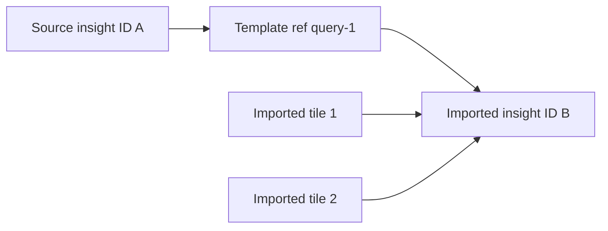

# Session 6: Move a graph, not a collection of database IDs

This session accompanies MID-02. Its implementation builds on the strict insight
validator from Session 5. See the ledger for verification status.

## Start with the import problem

Project A has a dashboard with two tiles sharing one signup insight. Project B
wants the same arrangement but should query B's events. Copying A's response
JSON directly would carry database identities into a different project. Those
identities identify A's records; they are not permission to reuse them in B.

A portable template describes the arrangement without carrying that ownership.
Version 1 contains dashboard fields, insight definitions, and tile references:

```json
{
  "version": 1,
  "name": "Growth",
  "description": "Signup views",
  "insights": [
    {"ref": "query-1", "name": "Signups", "type": "trend", "config": {"event": "signup"}}
  ],
  "tiles": [
    {"insightRef": "query-1", "layout": {"x": 0, "y": 0}},
    {"insightRef": "query-1", "layout": {"x": 6, "y": 0}}
  ]
}
```

`query-1` means "this document's query definition." It is not a database ID.
On import, the service makes a new insight and maps `query-1` to its new ID.
Both tiles use that mapping, preserving sharing inside the imported dashboard.



Think of moving a set of instructions to a new workshop. Labels such as
"part A" tell you which pieces connect. They do not require the new workshop
to use the original workshop's shelf addresses. Template refs are labels;
project-scoped database IDs are the actual shelf addresses.

## Versioning defines the document's contract

The version is explicit so a future importer can distinguish different formats.
The first implementation accepts version 1 and rejects unknown versions. It
does not guess how a newer format should behave.

Version 1 allows at most 50 insight definitions, 100 tiles, and 256 KiB of request
body bytes. Names contain 1–200 trimmed characters; descriptions allow up to
2,000. Configurations and layouts are objects. Each config also passes the
32 KiB limit and semantic checks from the shared insight validator.

These are several different bounds. A document can have only one insight and
still exceed its byte limit. A tiny document can contain a dangling reference.
A syntactically valid JSON config can contain an invalid interval. Each check
answers a separate question.

## Validate the whole reference graph

Read [DashboardTemplateService](../../src/Pulse.Infrastructure/Services/DashboardTemplateService.cs).
The validation phase checks the entire document before a database transaction:

1. The version and field sizes are supported.
2. Definition refs are unique, nonblank, and case-sensitive.
3. Every insight configuration is valid.
4. Every tile points to a defined ref and has an object layout.
5. Every insight definition is used by at least one tile.
6. No parsed filter targets a project-local cohort.

The cohort rule is deliberate. A cohort ID from A has no portable meaning in B.
The validator examines parsed filters, so it does not confuse an ordinary
property value containing the word `cohort` with an actual cohort dependency.
Event and person-property filters retain their existing semantics.

**Predict:** changing a tile's reference from `query-1` to `QUERY-1` creates a
dangling reference unless a matching uppercase definition exists. Deleting all
tiles while keeping the insight definition creates an unused definition. Both
documents are rejected without creating rows.

## Map references, then commit once

After validation, import creates a new dashboard and a dictionary from each
document ref to a new `Insight`. It constructs tiles through that dictionary,
saves the complete graph, and commits one transaction.

Every imported database ID is fresh. Importing the same file twice creates two
independent graphs. Sharing is preserved within each graph; it is not extended
between separate imports. Compare this with Session 4's duplication, which
intentionally shares the original saved insights in the same project.

The importer stores validated storage config, preserving omitted relative dates.
It does not save preview dates resolved during validation. An explicit historical
range stays explicit; an omitted range remains relative on future refreshes.

## Bound the body even when no length is declared

Read [LimitedJsonBody](../../src/Pulse.Api/Endpoints/LimitedJsonBody.cs). A
`Content-Length` check can reject a declared oversized body early, but some
requests do not declare a length. The reader also counts actual bytes while
reading and stops after the allowed limit plus one byte. It returns 413 without
parsing an unbounded document.

The extra byte answers whether the body exceeds the limit. Reading exactly the
limit alone cannot distinguish a body of that size from a longer body whose
remaining bytes have not yet arrived. This is the same boundary-testing habit
as loading 101 rows to enforce a maximum of 100.

## Trace the HTTP path

[DashboardTemplateEndpoints](../../src/Pulse.Api/Endpoints/DashboardTemplateEndpoints.cs)
authorizes export against the source project and import against the destination.
Possessing a template does not require access to its original project during
import; the portable document carries definitions, not authority.

```text
GET  /api/projects/{projectId}/dashboards/{dashboardId}/template
POST /api/projects/{projectId}/dashboards/import
```

Export of an unsupported stored source returns 409, including invalid config,
unavailable insight references, or a document exceeding its limits. Import of
an invalid document returns 400; oversized bodies return 413. Successful import
returns 201, a Location header, and the existing dashboard response shape.

## Reproduce the important examples

[DashboardTemplateTests](../../tests/Pulse.Tests/Api/DashboardTemplateTests.cs)
exports from one account's project and imports into another. The projects have
different signup event counts. Refreshing the imported dashboard must return
the destination's count. This proves project mapping more directly than merely
asserting that the imported dashboard has a different GUID.

The body-limit cases exercise both declared and unknown lengths. Graph cases
exercise duplicate refs, unused definitions, dangling refs, cohort dependencies,
invalid configuration, invalid layout shape, and collection limits.

```powershell
dotnet test --filter FullyQualifiedName~DashboardTemplateTests
```

## Teach it back in progressively more technical language

**First explanation:** the template copies instructions into another project.

**Second explanation:** the document names its own query definitions and tells
each tile which definition to use. Import creates new records for those names.

**Code explanation:** a case-sensitive dictionary maps document refs to newly
generated insight entities; tile rows receive those entities' IDs; the complete
graph commits atomically in the destination project.

Now explain why a copied database ID is insufficient, why unreferenced definitions
are rejected, and why a project-local cohort cannot silently become portable.
Use a concrete two-tile example each time, then point to the corresponding
validation branch and test fixture.
