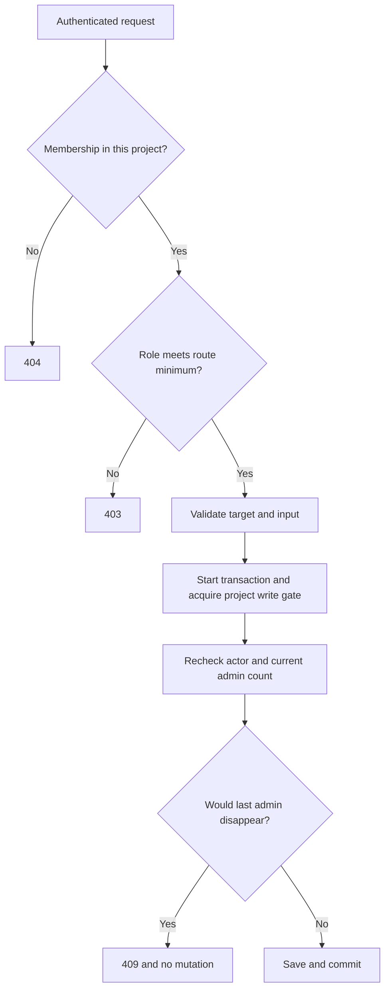

# Session 8: who may change this project?

Stories: SR-02, with SR-01's first schema evolution. Check the
[verification record](verification.md) for executed tests; code existing on disk
does not by itself mean a lesson's behavior is verified.

## Start with a prediction

Alex owns a project. Bea accepts an invitation. Bea can view the dashboard but
cannot add a tile. Alex promotes Bea to editor. Bea can now add a tile using the
same login token. Why did Bea not need to log in again?

The token identifies Bea. Each project request reads Bea's current membership
from the database. The role lives on that membership, rather than being copied
into a long-lived login token. Promoting or removing Bea changes what the next
request is permitted to do.

Say the same thing three ways:

1. Authentication answers **who**. Project membership answers **where**. A role
   answers **which operations**. All three questions matter.
2. A building badge identifies you. Being assigned to a particular room lets
   you enter it. Having the room's maintenance responsibility lets you change it.
3. In code: extract the user ID, query membership by both project and user,
   compare its role with the route's minimum role, then run the scoped handler.

The analogy stops at the database boundary: software requests run concurrently.
Two administrators may act at nearly the same moment. That needs a transaction,
not merely a convincing explanation of the intended policy.

## Trace a real request

Read these files in order, keeping one browser tab per layer:

- [ProjectPermissionMatrix](../../src/Pulse.Api/Auth/ProjectPermissionMatrix.cs)
  classifies routes explicitly, including read-only POST operations.
- [ProjectAccessService](../../src/Pulse.Api/Auth/ProjectAccessService.cs)
  resolves the current membership and compares roles.
- [ProjectEndpoints](../../src/Pulse.Api/Endpoints/ProjectEndpoints.cs)
  validates the request and maps a domain outcome to an HTTP response.
- [ProjectMembershipService](../../src/Pulse.Infrastructure/Services/ProjectMembershipService.cs)
  owns the membership transaction and last-administrator invariant.
- [ProjectMembership](../../src/Pulse.Domain/Entities/ProjectMembership.cs)
  stores the role that applies to one user in one project.

For `PUT /api/projects/P/members/U/role`, substitute actual IDs for `P` and `U`.
The caller must currently be an administrator of `P`. The target membership
must belong to that same project. The requested role must be the word `viewer`,
`editor`, or `admin`; `"0"` is invalid even though an enum has numeric values.

Why two permission checks? The first rejects an inappropriate HTTP request
early. The second checks authority after the transaction has acquired the
write gate, because another request might have changed the caller's membership
between those moments. The service protects its own mutation boundary.

## Roles belong to actions, not verbs

| Request | Minimum role | Why |
| --- | --- | --- |
| Read a saved dashboard | viewer | Reads configuration |
| POST a query preview | viewer | Computes a result without saving configuration |
| POST a dashboard | editor | Creates project configuration |
| POST a member invitation | admin | Changes project access |
| Delete a person | admin | Changes retained project data |

A shortcut such as “GET means viewer, POST means editor” misclassifies both
preview and invitation. The [full matrix](../../docs/project-permissions.md)
is an explicit inventory. The route-inventory test catches a future route that
was added without a permission classification. It does not prove that every
handler calls the guard, which is why behavioral permission tests also exist.

## A response can accidentally grant more permission

Suppose Bea is a viewer, but project detail includes the project's write key.
Bea could copy that key and use its SDK ingestion capability. The role guard
would have correctly authorized viewing the project, yet the response would
have handed out an additional credential.

`RoleProjectResponse` therefore omits both credential properties for viewers
and editors. Tests inspect the actual serialized JSON for absence of the field
names and the secret values. Checking only that a C# property is null would not
prove what was sent over HTTP. Administrators retain access to the keys.
Restricted personal tokens add another intersection in SR-16; the scope column
in the matrix is preparation until that story's enforcement is implemented.

## Why the database upgrade uses a different default

Before roles existed, every project member had broad management access. Turning
all of them into viewers during upgrade could lock everyone out of membership
management. The role migration backfills existing rows as administrators.
New invitations explicitly create viewers, while new project creators are admins.

These are three distinct decisions: preservation of existing access, the least
privilege starting point for a new invitation, and the initial project owner.
Avoid one global database default as a substitute for understanding them.

The migration test starts at the **previous** schema, inserts a membership
using that schema's columns, checks that startup refuses the pending upgrade,
upgrades, then checks the same IDs and timestamp plus the new admin role. This
is more informative than testing only an empty latest-version database.

## Two admins, one invariant

Imagine Alex and Bea are the only admins. Both request removal of their own
admin role. A broken implementation reads “two admins” twice, then performs
both updates. Each request seems valid in isolation; together they violate
the promise that at least one admin remains.

The membership service begins a transaction and performs a project-row write
before counting admins. SQLite serializes competing writers. The next writer
must inspect the committed state left by the first writer. The no-op project
update is a write gate; it is not a project rename. On this SQLite implementation
the underlying write contention is database-wide, even though the logical gate
is attached to a project. Do not claim independent per-project write locks.

[ProjectMembershipConcurrencyTests](../../tests/Pulse.Tests/Infrastructure/ProjectMembershipConcurrencyTests.cs)
uses two contexts and a barrier before transaction acquisition. The barrier makes
both attempts reach the same stage without random sleeps. One mutation succeeds;
the other is rejected by the invariant or a bounded SQLite lock failure. The
final persisted admin count must be one. A lock failure is not successful work.

## Practice ladder

1. Find the role used when a project is created. Predict a creator's first
   project-detail response. Check the response assertion in the role tests.
2. Trace a viewer's dashboard creation attempt. Point to the exact guard that
   stops it before any dashboard row is inserted.
3. Promote the viewer to editor in an isolated test. Keep the existing token.
   Explain why the next creation attempt can succeed.
4. Locate both project serialization paths: list and detail. Explain how both
   avoid leaking keys and why testing only detail would be insufficient.
5. Sketch the broken two-admin interleaving on paper. Add the transaction's
   write gate and redraw which observations are now possible.
6. Propose a new route and classify its minimum role before writing its handler.
   Explain its side effects in one sentence to justify your choice.

Use [your journal template](practice-journal-template.md). Record one prediction
you got wrong, the line of code that changed your understanding, and one test
that could protect that understanding during a refactor.

## Teach back without looking

Why are “authenticated,” “member,” and “admin” separate facts? Why can a POST be
read-only? Why is omitting a credential part of authorization design? Why does
checking the admin count outside the transaction fail under concurrency? Why
does the migration preserve admin access while invitations start as viewer?
