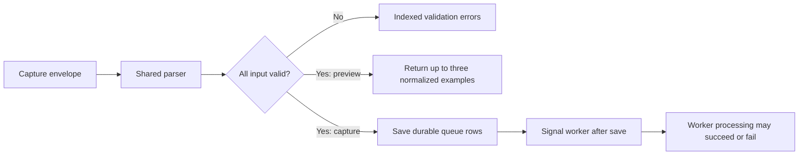

# Session 12: valid input, durable acceptance, successful processing

Stories: MID-20 through MID-22. See the [ledger](stories.json) for execution
status. Three different milestones recur throughout asynchronous systems:

1. The input is valid enough to accept.
2. The work is durably recorded in a queue.
3. The worker successfully produces the intended result.

A capture validation preview proves the first milestone. A 202 capture response
proves queue acceptance. A processed event plus its related identity/registry
state provides evidence for the third. Treating those milestones as interchangeable
causes confusing product messages and incorrect tests.

## A preview follows the parser and stops there

[CaptureRequestParser](../../src/Pulse.Api/Endpoints/CaptureRequestParser.cs)
contains normalization with no database dependencies. Both the actual capture
handler and `/api/projects/P/capture/validate` call it. Its existing semantics
remain explicit: a supplied batch takes precedence over top-level event fields;
names and identities are trimmed; non-object properties normalize to `{}`;
an omitted timestamp stays null; batches contain at most 1,000 items.

An explicit null batch item now produces an indexed validation error instead
of dereferencing a missing item. If one item is invalid, real admission rejects
the complete request before enqueueing. The parser may have normalized earlier
valid items, but the caller must inspect its errors before using those results.

The preview route is a viewer operation. Its project comes from the authorized
URL; any supplied `api_key` property, even null, is rejected. This avoids making
the route ambiguously combine two project-selection mechanisms. The body is
limited to 1 MiB by both declared length and actual bytes read.

The response reports the full event count and only the first three normalized
events. `previewTruncated` describes response sampling, not partial validation.
All input items must pass before a successful preview is returned. The response
uses `Cache-Control: no-store` because it can contain supplied identities and
property values.

Draw the path as a fork:

The preview does not call real capture and then delete its effects. It never
adds queue, person, event, or registry rows in the first place. That difference
matters because deleting afterward cannot reliably undo signals, concurrent
reads, or processing that has already started.

## Stored replay envelopes are another format

Public capture JSON uses fields such as `event` and `distinct_id`. Dead letters
store serialized `IncomingEvent` envelopes, with the properties document nested
as the `PropertiesJson` string. Applying the public request parser to that stored
envelope would validate the wrong contract.

[ReplayEnvelopeValidator](../../src/Pulse.Infrastructure/Services/ReplayEnvelopeValidator.cs)
is a pure Infrastructure helper. It distinguishes an unreadable outer envelope,
a missing envelope, missing independent fields, invalid nested properties JSON,
and valid JSON whose root is not an object. Issue messages are fixed descriptions;
they never paste the payload or arbitrary parser exception text into diagnostics.

If the envelope cannot be read at all, dependent field checks cannot proceed.
If it can be read, missing name, identity, and properties can be reported together.
This is the difference between one root failure and several independent failures.

The check endpoint and actual replay use the same validity result. A check
returns `replayable:true` without changing the letter, queue, events, or counters.
It does not reserve anything. Another operator can replay the letter immediately
after the check, so your subsequent replay can correctly receive 404.

Analogy: checking whether a seat is available does not book the seat. In code,
the check is a read; the replay is a transaction that consumes the letter and
creates queue work.

## Why this batch intentionally permits partial progress

`POST /api/projects/P/ingestion/dead-letters/replay-batch` accepts 1–20 unique
nonempty IDs. Validation of the list happens before any replay. Admin access is
required because replay changes ingestion state. Each item calls the existing
single-letter replay operation sequentially and commits independently.

For input `[good, invalid, missing, foreign]`, the expected outcomes are
`[queued, invalidPayload, notFound, notFound]`. Foreign and missing IDs have the
same observable result. The response preserves input order and derives its
aggregate counts from those result entries.

This repeats the dashboard batch lesson with a different contract:

| Batch | Promise | Transaction boundary |
| --- | --- | --- |
| Dashboard tile layouts | All selected layout changes succeed together | Whole batch |
| Dead-letter replay | Each selected recovery has its own outcome | One letter |

Neither choice is universally better. Layouts describe one coordinated edit;
replay describes independent recovery attempts. The correct boundary follows
the product promise.

An unexpected database error stops the loop. Earlier commits remain committed;
later letters remain unattempted. The service must not continue using uncertain
tracked state or invent a successful response for the failed item. Cancellation
has the same limitation: it cannot undo transactions already committed earlier.

If the client loses the complete response and retries, consumed letters return
`notFound`. That is not proof of a new failure, nor an exactly-once event guarantee.
It means this letter is no longer available to consume.

## Evidence to inspect

[CaptureRecoveryTests](../../tests/Pulse.Tests/Api/CaptureRecoveryTests.cs) disables
only the ingestion worker in one isolated host so the test can inspect queued
payloads. It compares real capture normalization with preview, verifies zero
preview writes, checks null items and body limits, and processes a mixed replay
batch through real endpoints.

[ReplayValidationTests](../../tests/Pulse.Tests/Infrastructure/ReplayValidationTests.cs)
covers each diagnostic code. Its batch test injects a storage failure for the
second enqueue: the first queued item must remain, the second letter's removal
must roll back, and the third letter must remain untouched. This is persisted
evidence of the declared partial-progress semantics.

## Practice ladder

1. Predict the normalized result of a single event with spaces in its name,
   array properties, and no timestamp. Explain each field separately.
2. Add a valid four-item batch. Explain why eventCount is four while preview
   contains three, and why every item still needs validation.
3. Trace the exact line where actual capture saves queue rows and the later
   line where it rings the worker signal. Explain why their order matters.
4. Write an outer envelope with invalid nested properties. Predict the issue
   code, then compare it with completely invalid outer JSON.
5. Sketch check → another operator replays → your replay. Explain the 404.
6. Predict storage after the first batch item commits and the second insert
   fails. Point to the test assertions that distinguish rollback scopes.

Teach back tomorrow: explain the three milestones without saying “success”
until you specify which milestone succeeded. Precise wording is a practical
engineering tool, especially when a request and its background work finish at
different times.
