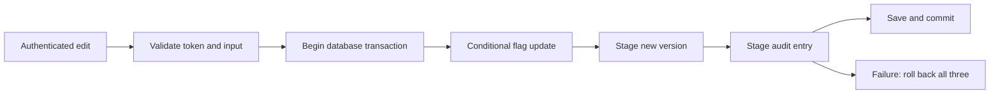
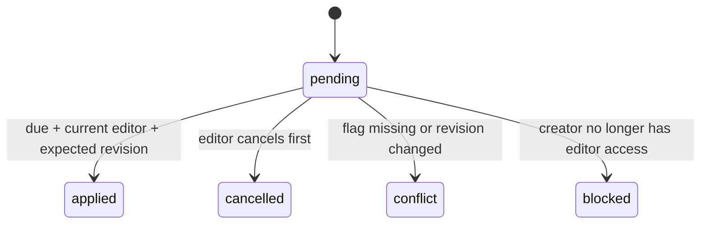

# Session 15 — Make a change that another engineer can trust

This session follows SR-03 through SR-06. You will trace one flag edit through
authorization, a revision check, configuration persistence, history, audit, and
scheduling. Read this in three passes: first the two-person example, then the
file map, then the experiments. You do not need to memorize all the names.

The source is implemented and the acceptance tests are being run. Consult the
[verification record](verification.md) for observed results; examples below
describe the intended contract, not a substitute for test evidence.

## Start with a mistake you can picture

Mina and Jo both open a flag at revision 1. Its rollout is 10 percent and its
name is `Welcome`. Mina changes the rollout to 25 percent. Jo changes the name
to `Welcome back`, submitting the old configuration still showing 10 percent.
An unconditional save can silently undo Mina's rollout change.

The API now gives each single-flag response an ETag:

```text
"flag-11111111-1111-1111-1111-111111111111-r1"
```

Mina's request says, in effect, “apply this only if this exact flag is still at
revision 1.” Her successful edit creates revision 2. Jo's revision-1 request
then receives 412. Jo must read the current configuration and decide how to
combine the edits. Automatically fetching a new token and resending an old
body would recreate the original problem.

Here is the same idea as a conversation with the database:

```text
Caller: Change project P's flag F, provided revision is still 1.
Database: I changed one matching row. The new revision is 2.
Other caller: Change that flag, provided revision is still 1.
Database: No row matches that condition anymore.
```

And here it is as the central predicate to find in the code:

```csharp
f.ProjectId == candidate.ProjectId
    && f.Id == candidate.Id
    && f.Revision == expectedRevision
```

The three conditions have different jobs. Project scopes the tenant. ID binds
the operation to the resource. Revision binds it to the state the caller saw.
Removing any condition weakens a different guarantee.

## Follow the files in order

| Open | Question to answer |
| --- | --- |
| [FlagPrecondition](../../src/Pulse.Api/Endpoints/FlagPrecondition.cs) | How does an HTTP token become an expected revision? |
| [FeatureFlagEndpoints](../../src/Pulse.Api/Endpoints/FeatureFlagEndpoints.cs) | Which guard runs before the flag lookup and precondition? |
| [AuthenticatedActor](../../src/Pulse.Api/Auth/AuthenticatedActor.cs) | Where does the actor identity come from? |
| [FlagMutationService](../../src/Pulse.Infrastructure/Services/FlagMutationService.cs) | Where is the actual conditional database write? |
| [ManagementAuditWriter](../../src/Pulse.Infrastructure/Services/ManagementAuditWriter.cs) | Which fields are allowed into durable audit summaries? |
| [FlagGovernanceEndpoints](../../src/Pulse.Api/Endpoints/FlagGovernanceEndpoints.cs) | How do history and restore expose the same mutation path? |
| [FlagScheduleService](../../src/Pulse.Infrastructure/Services/FlagScheduleService.cs) | Which prerequisites are checked again when a schedule becomes due? |

Read only the named method on your first pass. On your second pass, follow its
call into the next file. On your third pass, close the files and draw the path
from memory. Reopening a file to correct your drawing is part of the exercise.

## One edit has several records

The live flag answers “what configuration is effective now?” A version snapshot
answers “what configuration resulted from revision 7?” An audit entry answers
“who performed this covered mutation, on which resource, and when?”

These are related records with different audiences. Version history includes
configuration because an authorized reader needs it to inspect and restore a
change. Audit summaries omit names, keys, targeting expressions, and variants:
those fields can contain arbitrary user text. Audit stores stable IDs and
allowlisted change metadata instead.



Think of the transaction as a sealed envelope containing the effective change
and its evidence. The envelope reaches storage together, or none of its contents
does. This analogy has a precise implementation: the service opens a transaction,
performs immediate SQL inside it, stages tracked additions on the same context,
then saves and commits. A separate audit context would fall outside that envelope.

`ExecuteUpdateAsync` runs immediately. It does not wait for `SaveChangesAsync`.
This is why an outer transaction matters: an injected audit-save failure must
also undo that already-executed update. Find that experiment in
[FlagMutationTransactionTests](../../tests/Pulse.Tests/Infrastructure/FlagMutationTransactionTests.cs).

Creation can use one `SaveChangesAsync` containing the new flag, snapshot, and
audit row; EF makes that multi-statement save atomic. Updates and deletions also
include immediate bulk commands and therefore explicitly own a wider transaction.
The scheduler passes its existing transaction to the shared update primitive.
It does not nest an independent mutation transaction.

## Read the response before deciding whether to retry

| Result | Meaning | Next action |
| --- | --- | --- |
| 400 | Token or configuration is malformed or unsupported | Correct the input |
| 404 | The resource is unavailable in this project/access context | Check the project and resource |
| 412 | The expected flag state no longer matches | Fetch and consciously reconcile |
| 428 | Required `If-Match` was omitted | Read the flag and send its ETag |
| 200 | An update committed | Keep the returned revision/ETag |
| 204 | A conditional deletion committed | Treat the flag as deleted |

The endpoint rejects wildcard, weak, and multiple ETags. A token for another
flag cannot authorize a write even if both flags have revision 1. A valid no-op
update still creates a new revision, history snapshot, and audit entry. That
choice makes “accepted configuration update” an observable event.

## Restore moves forward

Suppose current revision is 8 and you restore revision 3. The resulting current
revision is 9. It contains revision-3 configuration but retains the live flag's
ID, project, key, and original creation time. Revisions never move backward;
otherwise an old revision-3 precondition could accidentally become valid again.

The service retains the newest 100 configuration snapshots for a live flag.
Pruning joins the mutation transaction. A missing retained target returns 404;
an invalid snapshot or a cohort reference that no longer belongs to this project
returns 409. Neither rejection consumes a revision.

Restoring targeting does not rewind people, cohort memberships, or incoming
events. If yesterday's cohort contained ten people and today's contains twelve,
restoring the same cohort reference can produce different decisions. History
stores configuration, not a frozen universe of every input to evaluation.

Migration creates one baseline snapshot for each preexisting flag. Its actor is
unknown and its origin is `baseline`. It does not fabricate audit entries for
changes made before audit collection existed. Historical raw configuration text
is preserved; restoration validates whether that configuration is supported now.

## Schedule a future condition, then recheck it

A schedule stores a due time, expected revision, creator, and target percentage.
It survives closing the browser and restarting the API. The worker periodically
looks for due pending rows; an in-memory signal merely wakes that search sooner.



An applied schedule changes only rollout percentage. It increments the flag
revision and writes history and audit through the same mutation primitive used
by human edits. The applied schedule state commits in that same transaction.
An interrupted transaction leaves the schedule pending and the flag unchanged.

If a human edit wins first, the schedule becomes a conflict when due. If
cancellation wins first, execution sees a non-pending row and does nothing.
If execution commits first, cancellation returns 409 and does not reverse it.
Two workers cannot both advance the same pending schedule. The database state
and conditional write establish this, not a process-local boolean.

Due time is eligibility, not an exact commit-time promise. A paused worker can
apply overdue work after restarting. `FlagScheduling:Enabled=false` pauses
execution; `FlagScheduling:AcceptNew=false` pauses new admission. Inspection and
cancellation remain available. Only the latest schedule row is retained per
flag; terminal metadata is replaced when another schedule is created.

## Practice in three short sessions

1. **Predict a stale edit.** Read a flag twice. Update with the first ETag, then
   send a different update with the second. Before running, write down the two
   expected statuses, final revision, and number of new audit rows. Compare
   your prediction with `TwoReaders_RejectStaleEdits_ThenPermitExplicitReconciliationAndNoOp`.
2. **Make evidence fail.** Open `FailAuditSave` in
   [GovernanceFixture](../../tests/Pulse.Tests/Infrastructure/GovernanceFixture.cs).
   Find the point where it throws. Identify which SQL statement already ran and
   which transaction must undo it. Run the rollback theory and inspect its
   assertions using a fresh context. Explain why the old tracked object alone
   would be weak verification.
3. **Move the clock.** Open
   [ScheduledFlagRolloutTests](../../tests/Pulse.Tests/Infrastructure/ScheduledFlagRolloutTests.cs).
   Compare one tick before due time with exact equality. Follow the changed
   prerequisite cases. Predict which records change when the creator is demoted.
   Then read the assertions and correct your prediction.

For repetition tomorrow, explain the same workflow without the words ETag,
transaction, or concurrency. Say: “I only want to change the version I read,”
“the change and its evidence must stay together,” and “the future task must
check whether it is still allowed.” Then reconnect each sentence to the precise
method and database condition that implements it.

## Teach back before moving on

- Why does checking a revision only in memory leave a race?
- Which records must roll back when saving audit evidence fails?
- Why is an audit sequence useful for pagination even if timestamps tie?
- Why does restoring revision 3 produce revision 9 rather than revision 3?
- Why can a schedule become blocked after its creator was authorized to create it?
- Which guarantees disappear if someone edits the SQLite database directly?

Application audit history records the covered application mutations. It is not
a tamper-proof ledger against a database administrator. Naming that boundary
accurately is part of owning a feature at mid/senior level.
