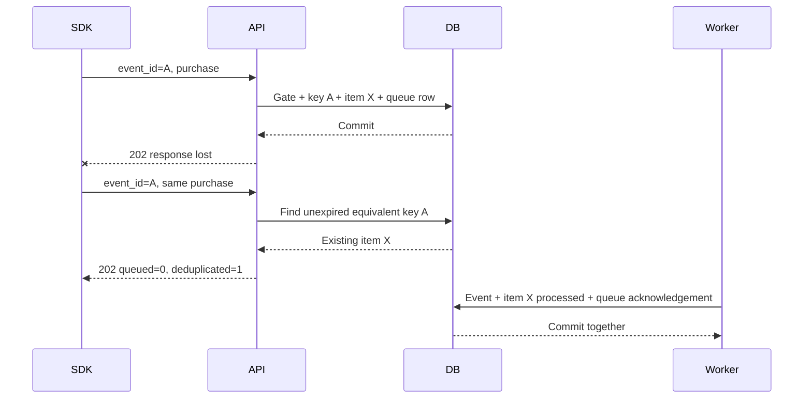

# Session 16 — Know whether you accepted the same work twice

This session follows SR-07, SR-08, and SR-09. Implementation and verification
are in progress; use the [verification record](verification.md) to distinguish
tests that exist from tests that passed.

Start with this situation: your SDK sends a purchase, the server accepts it,
and the connection closes before the response reaches you. You cannot tell
whether to retry. Retrying an ordinary capture creates another admission.
Attaching one stable `event_id` lets the server recognize the same logical
submission during a seven-day window.

## Five IDs with different jobs

| Identifier | Who creates it? | What it identifies |
| --- | --- | --- |
| Client `event_id` | SDK/client | One logical submission within a project's bounded retry window |
| Admission/processing item ID | Server | The accepted processing obligation across worker retries and replay |
| Queue `Seq` | Database | One placement in the queue; replay gets a new placement |
| Analytics event ID | Server | The actual processed event row |
| Receipt ID | Server | One request's ordered references to processing obligations |

Start with client ID, admission ID, and queue sequence. Once those are clear,
add event and receipt IDs to your drawing. Each identifies a different thing.

Say it again without implementation names: a customer brings a claim number,
the service creates a work item, the queue assigns it a place, processing
creates a result, and a receipt tells the customer which work they submitted.
Moving the work to a new queue position does not create a new customer claim.

## Follow one successful duplicate

The second response does not mean another worker task was created. It means
the repeated request matches already accepted work. The seven-day expiry stays
anchored to the first admission; repeated retries do not keep extending it.
At exact expiry, reusing the client ID may create a new admission and event.
This is a bounded retry guarantee, not forever deduplication.

Open [QueueAdmissionService](../../src/Pulse.Infrastructure/Services/QueueAdmissionService.cs).
Find `stored`, `submitted`, and `references`. They serve different purposes:
stored keys recognize previous requests; the submitted dictionary recognizes
repeated IDs inside this batch; references preserve every submitted position
even when several positions refer to the same processing item.

## Equivalent means a documented representation

[CaptureFingerprint](../../src/Pulse.Infrastructure/Services/CaptureFingerprint.cs)
defines version 1 of the comparison. It includes the trimmed event name and
identity, the supplied timestamp as a UTC instant or an explicit omitted marker,
and canonicalized properties. Object keys sort recursively using ordinal
comparison. Arrays retain order. Scalar JSON types remain distinct.

| Pair | Equivalent in version 1? | Reason |
| --- | --- | --- |
| `{"a":1,"b":2}` and `{"b":2,"a":1}` | Yes | Object ordering is normalized |
| `[1,2]` and `[2,1]` | No | Array position can carry meaning |
| `1` and `"1"` | No | Number and string are different types |
| `1` and `1.0` | No | Number spelling is preserved in v1 |
| Same instant with different timezone offsets | Yes | Supplied timestamps use UTC ticks |
| Omitted timestamp and a supplied timestamp | No | Omission is part of the payload contract |

Why preserve number spelling? It is a deliberately simple version-one rule
that avoids pretending to have defined every numeric equivalence. A later
fingerprint version must account for still-live older keys. Never silently
change hashing rules under existing retry windows.

Duplicate object member names are rejected for ID-bearing payloads. JSON such
as `{"plan":"free","plan":"pro"}` leaves readers disagreeing about which
value is effective. Rejecting that ambiguity makes fingerprinting and processing
agree about the submitted content. Existing no-ID capture normalization remains
compatible.

## A conflict rejects the entire batch

Imagine `[new B, conflicting A]`. Queuing B before discovering A's conflict
would leave the caller with a partial result despite a failed request. The
service evaluates every key and the resulting capacity requirement before
inserting queue, key, or receipt records. Its transaction also rolls back the
internal gate change on rejection.

The same reasoning applies to `[B, changed B]` inside one request. Equivalent
repetitions collapse; conflicting repetitions return 409 with no new admissions.
Read the assertions in
[CaptureIdempotencyTests](../../tests/Pulse.Tests/Infrastructure/CaptureIdempotencyTests.cs)
before reading their setup. Predict the queue, key, item, and receipt counts.

## A receipt describes positions, not unique work

Send `X-Capture-Receipt: true` to receive a receipt ID and a project-scoped
status URL. Three repeated positions can all reference item X. The receipt
then reports three queued positions even though the queue contains one row.
After X processes, all three positions report processed.

This is why the schema has a separate
[CaptureReceiptItem](../../src/Pulse.Domain/Entities/CaptureAdmission.cs) reference
with an ordinal. A single integer count on the capture response could not
represent sharing, ordering, actual result IDs, and replay history.

[CaptureReceiptService](../../src/Pulse.Infrastructure/Services/CaptureReceiptService.cs)
returns metadata, not raw payloads. The status route requires project membership;
the capture write key alone does not grant access to processing history.
Every new admission creates a processing item even when the original request
did not ask for a receipt. A later equivalent retry can therefore request one.
A legacy retry key with missing processing metadata causes receipt-enabled
admission to return 409 before accepting any new batch items. The service does
not invent an old processed state from incomplete evidence.

On success, the actual new event ID is recorded in the same transaction as
event insertion and queue acknowledgement. On failure, the actual dead-letter
ID joins the failure transaction. Replay keeps the logical item, increments
its replay generation, clears current terminal pointers, and makes it queued
again. The latest 20 transition records remain available in storage.

## Capacity belongs inside admission

The limit measures pending queue rows, including delayed work. It is different
from requests per minute. A fast producer can send few very large requests;
a retry can send many requests while creating no new work.

Suppose the queue holds two rows and the configured limit is three:

| Request | New rows required | Outcome |
| --- | --- | --- |
| Two ordinary new events | 2 | 429, no new queue/key/receipt rows |
| One ordinary new event | 1 | Fits exactly |
| Three equivalent retries | 0 | Fits without consuming capacity |

Capture, dead-letter replay, and limit edits acquire the same durable project
gate in their transaction. This prevents two requests from each believing they
can spend the last available slot. A local variable or process-wide semaphore
would not coordinate two application instances sharing the database.

Lowering a limit below the existing queue depth retains all existing work.
Fully deduplicated retries still need zero slots. Replay needs one new slot;
on rejection its dead letter remains intact. `Retry-After: 1` is guidance to
try later, not a reservation for capacity one second from now.

## Expiry is a relationship problem

An unfinished receipt has no fixed deletion deadline. Once all referenced
items are terminal, it expires seven days after the last terminal transition.
Replay makes the receipt unfinished again. A later final transition establishes
a new completion time.

Cleanup runs in bounded batches. It removes expired receipt references before
considering shared processing items, and retains an item while a live receipt,
admission key, queue row, or dead letter needs it. A processed receipt does not
promise the event will exist forever; later retention or erasure can retire its
event pointer without pretending that capture is pending again.

## Your practice sequence

1. Draw the five IDs for one event and one receipt. Replay it and cross out only
   the old queue placement and current dead-letter pointer. Keep the admission ID.
2. Predict the fingerprint table above, then run `CaptureFingerprintTests`.
   Add a nested array/object example in your practice branch and explain it.
3. Read `ConflictingKeys_RejectWholeBatch_AndEquivalentPositionsCollapse`.
   Count submitted positions separately from newly queued work.
4. Read `CrashBeforeAcknowledgement_KeepsReceiptQueuedAndNoEvent_ThenRetrySucceeds`.
   Find the injected failure and name every record that must roll back.
5. Read `ConcurrentAdmissions_CannotSpendTheSameLastSlot`. Point to the gate
   write and explain why counting before it would invalidate the proof.

Revisit these questions tomorrow: Which retry needs a client event ID? Which
retry needs a new queue position? Which count is by submitted position? Which
record must remain when a request asks for a receipt after an earlier response
was lost? Use the file names only after you can explain the relationship plainly.
