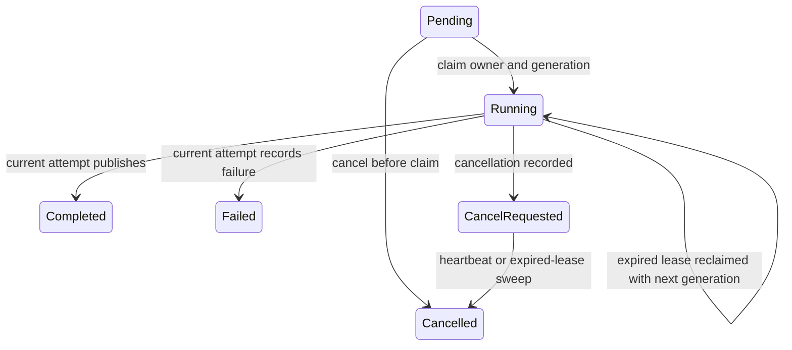

# Session 18: recoverable exports and fixed input

Stories: SR-12 and SR-13, building on MID-23 through MID-26. This lesson is
written alongside implementation. Consult [the verification record](verification.md)
for what has actually passed; examples below describe the intended integrated behavior.

## Start with a user-visible problem

You ask for a large event export. The worker marks it Running, then the machine
restarts. If the worker only searches for Pending jobs, yours remains Running
forever. A restart erased the program's memory, but the database still remembers
the claim. Recovery must therefore interpret durable state.

A second problem appears after recovery: the original worker might be delayed,
not dead. Worker A resumes while worker B is already rebuilding the document.
Both can calculate output. Only one may publish it. Calculation and permission
to publish are separate concerns.

A third problem involves the input. Page one was read before a person merge;
page two was read afterward. Even perfectly ordered cursor pagination cannot
turn those two reads into a fixed database view. Snapshot mode first copies a
bounded set of event values, then renders that copy.

Say this back in everyday language: the job remembers who may finish it, and
a snapshot job also remembers exactly which input that finisher must use.

## Read the code in this order

| File | Question to answer while reading |
| --- | --- |
| [ExportJob](../../src/Pulse.Domain/Entities/ExportJob.cs) | Which facts survive a process restart? |
| [ExportOwnershipService](../../src/Pulse.Infrastructure/Services/ExportOwnershipService.cs) | Which SQL predicates give one attempt permission to change state? |
| [ExportJobProcessor](../../src/Pulse.Infrastructure/Services/ExportJobProcessor.cs) | Where does computation occur, and how does cancellation reach it? |
| [ExportSnapshotService](../../src/Pulse.Infrastructure/Services/ExportSnapshotService.cs) | What commits together before input becomes authoritative? |
| [ExportHistoryEndpoints](../../src/Pulse.Api/Endpoints/ExportHistoryEndpoints.cs) | What does a repeated cancel request return? |
| [ExportJobOperationsService](../../src/Pulse.Infrastructure/Services/ExportJobOperationsService.cs) | How do new retry jobs differ from recovery? |

First trace one Pending job to Completed without thinking about failure. On a
second pass, stop after every await and ask what happens if the process ends
there. On a third pass, imagine another process continuing from persisted state.
Three passes through the same code reveal different responsibilities.

## The state machine, three ways



In words: cancellation is a durable decision. A worker observes that decision
and stops. If it never returns, the recovery sweep finishes cancellation.
Completed and Failed jobs reject cancellation with 409. Repeated cancellation
of CancelRequested or Cancelled is successful, so callers can retry a lost response.

As a table of HTTP examples:

| State before POST `/api/projects/P/exports/J/cancel` | Response | Persisted state |
| --- | --- | --- |
| Pending | 200 | Cancelled immediately |
| Running | 202 | CancelRequested |
| CancelRequested | 202 | CancelRequested |
| Cancelled | 200 | Cancelled |
| Completed or Failed | 409 | Existing terminal state |
| Missing or foreign-project job | 404 | No change |

The route requires Editor permission. A Viewer may inspect history and status
but cannot cancel work. The response spelling is `cancelRequested`; history
filter choices are case insensitive. Cancellation clears unpublished output;
a cancelled job cannot satisfy the download route's Completed requirement.

## A lease is temporary; a generation distinguishes attempts

Each worker instance has a random owner token. Each successful claim increments
the job's attempt generation and gives it a 30-second lease. Heartbeats extend
that lease only while the same owner and generation still hold unexpired Running work.

Predict this sequence before reading the answer:

1. A claims generation 1 at 10:00:00.
2. A stops responding.
3. At 10:00:30, B claims generation 2.
4. A finishes a perfectly valid CSV and tries to publish it.

A's update matches zero rows. The job still has B's generation. A must discard
its output even if its CSV is correct. The database predicate checks project,
job, owner, generation, Running state, and unexpired lease. This is the same
fencing idea from ingestion, applied to a different unit of work.

Now change step 3: the user cancels instead. A still cannot publish, because
CancelRequested does not match Running. No preliminary read can replace that
condition in the final write. There is always time for cancellation between a
read and a later save.

The contested operation has one winner. If completion commits first, cancel
returns 409. If cancel commits first, publication affects zero rows. Both
outcomes are valid. A test should assert this relationship, not assume a
particular thread always wins the race.

## Cancellation must reach active work

Checking once before an export is insufficient. The processor checks ownership
between pages and again before publication. A short monitoring loop also uses
a separate dependency-injection scope and database context to observe state
while a page query is active. Losing ownership or observing cancellation cancels
the linked token passed into queries.

Why a separate context? Entity Framework contexts are not intended for overlapping
operations. Running a heartbeat on the same context as the active query would
introduce a concurrency error into the mechanism meant to improve reliability.

Host shutdown is different from a computation failure. Shutdown cancellation
propagates; it does not write Failed. The durable Running lease eventually expires,
allowing a later worker to recover. Error responses use controlled messages;
arbitrary provider exception text is not a suitable stored user-facing explanation.

## Cursor, cutoff, and snapshot are different tools

| Tool | What it remembers | What can still change? |
| --- | --- | --- |
| Cursor | Position for the next page | Values of existing rows and membership of later pages |
| Timestamp cutoff | Which timestamps are eligible | Late inserts, person merges, edits, deletions |
| Copied snapshot | The selected full export values | Original rows may change; the copy stays fixed |

Snapshot admission uses `consistency: "snapshot"`, events only, JSON or CSV,
an explicit inclusive date range of at most 90 days, and optionally an event
name. Property filters are unsupported in this first version. Live mode remains
the default. The capture time is when the worker copies data, not submission time.

The worker opens a transaction, fences its attempt, selects project-scoped rows
in timestamp/ID order, serializes complete export values, and writes copies keyed
by job and ordinal. The ready marker and `snapshotCapturedAt` commit with those
copies. No marker means no authoritative snapshot, including an interrupted copy.
An empty snapshot still needs a ready marker: zero rows is a valid result.

The cap is 10,000 rows and 16 MiB of serialized copied data. Reading row 10,001
proves the row cap was exceeded. Counting UTF-8 bytes catches oversized properties.
Either failure rolls back capture and produces a named failure reason; returning
the first 10,000 rows would falsely suggest a complete export.

After readiness, rendering occurs outside the capture transaction. Ordinal
pages read the copies. Reclaimed attempts reuse those rows and the original
capture timestamp. Identity merges, source deletion, and late insertion cannot
rewrite that saved input. Snapshot capture is bounded but still holds a SQLite
write transaction; measure its duration before choosing deployment capacity.

## Two meanings of retry

Recovery keeps the same job ID, advances its attempt generation, and reuses any
ready snapshot. The user requested one job, and infrastructure is finishing it.

The existing retry endpoint creates a different job from a Failed job's request
parameters. It copies consistency mode but does not copy the old job's snapshot.
This is a new request with a later capture view. Its source job remains Failed
as evidence. Draw two boxes with different IDs to remember that distinction.

Deletion and cancellation remove snapshot copies in coordinated transactions.
Keeping invisible copies after deleting their job would create orphaned data.
The later erasure story must also invalidate project exports and their snapshots;
fixed input must not bypass a data-lifecycle operation.

## Practice in small passes

Start with isolated test databases:

```powershell
dotnet test --filter FullyQualifiedName~ExportCancellationRecoveryTests
dotnet test --filter FullyQualifiedName~EventExportSnapshotTests
dotnet test --filter FullyQualifiedName~ExportTests
```

1. Open the expired-owner test. Before running it, write which attempt can
   heartbeat and publish at expiry equality. The fake clock advances without sleeping.
2. Open the competing cancel/publish test. List both allowed outcomes and explain
   why Completed plus a successful 202 cancellation would be inconsistent.
3. In the snapshot mutation test, identify the actual identity merge, deletion,
   and late insert. Explain why checking only the final row count would be weaker
   than comparing the serialized saved values.
4. Inspect the injected snapshot-save failure. Check a new context afterward:
   no rows and no ready marker must survive. A tracked object is not proof of commit.
5. Read the empty-snapshot test. Predict what repeated recovery would do if the
   implementation inferred readiness from `rows.Count > 0` instead of a marker.

For a manual rehearsal, use a disposable database and turn off export claims
with `Exports:ClaimsEnabled=false` before admitting a job. Inspect its Pending
status, cancel it, repeat cancellation, and verify download returns 409. Turn
claims on for a separate snapshot job. Fetch status, save its capture timestamp,
download it, and compare integrity metadata with the actual bytes.

## Common mistakes to recognize in reviews

Saving a previously loaded entity can overwrite CancelRequested with Completed.
Look for the conditional publication predicate instead of a general SaveChanges.

Treating all exceptions as Failed converts host shutdown into a user-visible
error and prevents automatic recovery. Separate cancellation from actual failure.

Calling a list of IDs a snapshot still rereads mutable values. Look for copied
PersonId, properties, timestamp, distinct ID, and event name in the saved row.

Clearing lease fields during a rollback does not make older workers harmless.
Stop old worker versions before deploying the ownership protocol. Operational
controls pause new claims or new snapshot admission; they do not erase history.

## Teach back without looking above

Explain to a teammate why an old worker may calculate output but may not publish
it. Then explain the same rule using a library checkout receipt: returning with
an expired receipt does not give you the current holder's permission.

Describe why a ready empty snapshot differs from an unfinished snapshot. Finally,
say whether retrying a Failed snapshot job and recovering its expired Running
attempt should use the same capture timestamp. Name the test that proves each answer.

Record your predictions, the observed outcome, and one corrected assumption in
[your practice journal](practice-journal-template.md). Revisit this lesson after
retention and erasure, because copied data changes what deletion must cover.
