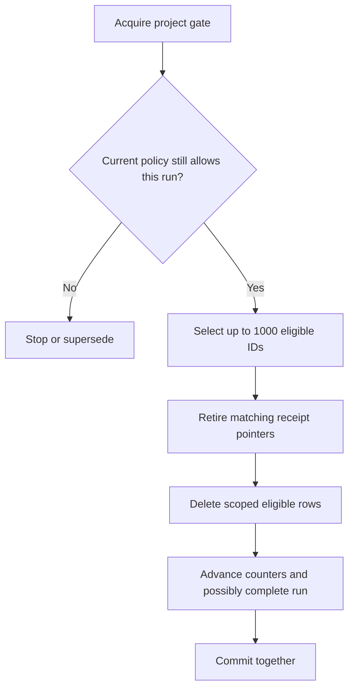

# Session 19: retention is a versioned deletion workflow

Story SR-14. The source is being integrated; use [verification.md](verification.md)
to distinguish implementation from executed evidence.

## Begin with three events

Suppose a 30-day policy produces cutoff `2026-03-01T10:00:00Z`. Predict the
eligibility of these event timestamps:

| Timestamp | Eligible? | Reason |
| --- | --- | --- |
| One tick before cutoff | Yes | Timestamp is strictly less than cutoff |
| Exactly at cutoff | No | Equality belongs to retained data |
| One tick after cutoff | No | Timestamp is newer than cutoff |

This feature uses event Timestamp, not arrival time, person creation time, or
the time a worker happened to process an event. An old event admitted today
may be deleted by a later sweep. That is eventual retention, not an admission rule.

Repeat the rule without symbols: keep the boundary and everything newer; remove
processed event rows strictly older than the chosen boundary. Then write it as
SQL: `ProjectId = project AND Timestamp < cutoff`. Both parts matter.

## Trace responsibility through the code

| File | Responsibility |
| --- | --- |
| [ProjectRetentionPolicy](../../src/Pulse.Domain/Entities/ProjectRetentionPolicy.cs) | Durable policy revision and run progress |
| [RetentionEndpoints](../../src/Pulse.Api/Endpoints/RetentionEndpoints.cs) | Admin routes, validation, preview, recent run observation |
| [EventRetentionService](../../src/Pulse.Infrastructure/Services/EventRetentionService.cs) | Shared gate, current-policy decision, bounded delete, atomic counters |
| [RetentionWorker](../../src/Pulse.Api/Lifecycle/RetentionWorker.cs) | Periodic bounded work and shutdown handling |
| [CaptureReceiptService](../../src/Pulse.Infrastructure/Services/CaptureReceiptService.cs) | Receipt outcomes that remain truthful after data removal |

Read ProcessBatchAsync once for the successful path. Read it again looking only
at early returns. Each early return expresses a reason deletion is not allowed:
maintenance pause, disabled policy, or an obsolete run revision. A third reading
should identify everything inside the transaction.

## A preview is an observation

GET `/api/projects/P/retention/preview` returns the policy revision, enabled flag,
days, observed time, cutoff, and current eligible count. Even a disabled policy
can be previewed. Previewing does not enable it or delete rows.

Why not promise to delete exactly that count later? Events can arrive between
preview and cleanup. A current count describes one observation, while the later
worker makes its own durable run with a fixed cutoff. Including revision and
time makes the observation interpretable.

New and migrated projects start disabled, with 365 days and revision 1. To enable
30 days, read the policy and PUT `{ "enabled": true, "days": 30,
"expectedRevision": 1 }`. The new revision is 2. Missing expectedRevision returns
428; an outdated one returns 412. Days must be between 30 and 3650.

This repeats the flag-edit lesson in a settings form. An administrator who read
revision 1 must not silently overwrite an administrator's revision 2. An update
must include the revision in the actual database predicate.

## The dangerous interleaving

Imagine this order:

1. A worker reads a 30-day policy.
2. An administrator changes it to 365 days.
3. The worker deletes rows using the old 30-day cutoff.

A plain earlier read allows that mistake. The policy update and the batch's
decision share the project's durable write gate and a transaction. Whichever
operation enters the serialized decision first finishes before the other.

If the batch commits first, those deletions occurred under the old valid policy.
The administrator's change applies to subsequent batches. If the policy update
commits first, an old run is superseded; subsequent cleanup cannot apply its old
revision. A longer period cannot restore rows that were already deleted.

Explain this using a queue at a counter: the clerk finishes the transaction
already at the counter before accepting the next instruction. The database gate
provides the ordering; an in-memory lock in one server would not coordinate a
second process.

## Durable progress over many small transactions

A run stores its project, policy revision, fixed cutoff, status, start time,
last batch time, batch count, and removed count. A filtered unique index permits
at most one Running run per project. The worker processes at most 20 projects
per sweep, with one batch of at most 1000 event IDs for each project.

The selection projects only IDs; event properties do not need to be loaded
just to delete a row. The delete repeats project and cutoff conditions. Counters
use the actual number deleted, not the earlier preview's count.

If the process stops before commit, no batch progress survives. If it stops
after commit, deletion and counters both survive. The replacement worker reads
the same run and cutoff. It does not move the cutoff forward merely because
the clock moved while the machine was down.

Exactly 1000 selected rows leave the run Running until a following batch proves
there are fewer remaining rows. This extra empty check is valid. Avoid declaring
completion simply because the first page was full: more rows may exist.

## A processed receipt stays processed

A receipt can point at an event that retention removes. The same deletion
transaction clears that pointer and records `retiredReason: "retention"` on
the processing item. Historical transition pointers are also cleared.

The item remains Processed. Its generation and completion time do not change.
Retention did not undo successful ingestion or create new work. Preserving its
completion time also avoids extending receipt lifetime every time data is removed.

This is another example of separating facts: an event was processed successfully,
and its stored row was later removed. Both can be true. A single boolean called
"exists" would not describe the full lifecycle.

## What the policy covers

Retention deletes eligible rows from Events. It does not delete people,
person properties, identity mappings, cohorts, registry definitions, queued work,
dead letters, export documents, or copied export snapshots. The next erasure
story has a broader inventory and must coordinate those copies explicitly.

State this precisely in a review: "30-day processed-event retention" is a useful
description. "All data disappears after 30 days" would be false for this feature.

## Reproduce and vary the experiment

Use a disposable database. Insert 1001 old rows, one boundary row, a newer row,
and a foreign project's old row. Keep one person and export document as controls.
Predict counts after the first and second committed batches.

After the first batch, create a new context and advance the fake clock. The
remaining old row should be deleted using the original cutoff. The boundary
row must survive that run even though the real-time horizon has moved.

Repeat, but disable the policy between batches. Repeat again with a longer
period. The old run becomes Superseded. Attempt the edit with an old expected
revision and predict 412 with no policy change.

Finally inject a database failure while updating run progress. Read from a new
context after rollback: deleted events and receipt pointers must still exist,
and the removed count must not advance. Checking only the thrown exception
would miss the most important claim: the batch was atomic.

Run focused checks with `dotnet test --filter FullyQualifiedName~EventRetentionTests`.
Keep the observed result and any failed prediction in your practice journal.

## Teach back in two sentences, then in a diagram

Explain why disabling a policy prevents future batches but cannot undo a batch
that already committed. Explain why a receipt can remain Processed with no
event ID. Draw the transaction around pointer retirement, event deletion, and
counter advancement; draw the preview outside that transaction.

Revisit flag revisions, ingestion admission gates, and export snapshots after
this lesson. Retention combines those earlier ideas into an operation where
an incorrect boundary or stale decision can permanently remove data.
