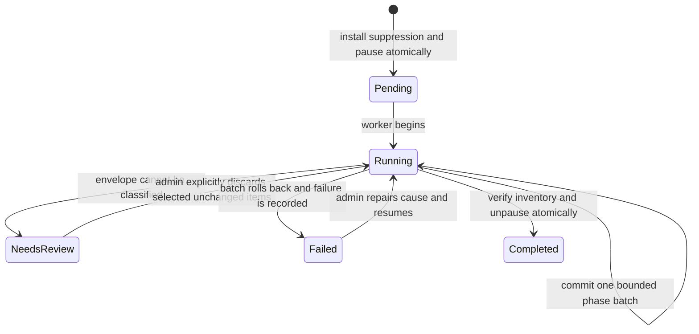

# Lesson 21: deletion is a workflow when data has copies

Stories: SR-15, revisiting SR-07 through SR-14. Start with [lesson 17](17-retries-and-worker-ownership.md) and [lesson 18](18-recoverable-exports.md). This lesson describes implementation; see the [verification record](verification.md) for what has actually passed.

## What you are learning

The small version of deletion is `DELETE FROM Persons WHERE Id = ...`. That statement does not answer the product question. A person's activity also exists in events, identity mappings, static cohorts, queued envelopes, dead letters, receipt references, and export copies. Some of those copies can create new rows later. Your job is to find the writers as well as the stored data.

By the end, you should be able to draw a data inventory, distinguish acceptance from completion, explain why a failed cleanup stays paused, and prove that an old worker cannot put data back. Read this twice on different days. On the first pass, follow one person. On the second, follow the transactions.

## Explanation one: follow the person

Imagine an anonymous visitor called `guest-a`. They later identify as `account-a`. Both aliases belong to one canonical person. An event arriving tomorrow may still use `guest-a`. Deleting the row for `account-a` without remembering the known aliases would let that event recreate a person.

Initiation freezes the aliases known at that moment. The job remembers keyed fingerprints, then pauses project data operations. Cleanup removes the associated data in short batches. After verification, the project becomes available again. Future capture and replay compare both `distinct_id` and an identify event's anonymous alias against suppression fingerprints. A match returns 422 instead of creating the identity again.

An alias the system has never observed cannot be inferred to belong to the erased person. That limit is part of the feature contract. This is a software workflow, not a claim of legal compliance or deletion from backups, external collectors, or previously downloaded files.

## Explanation two: close a workshop before removing hazardous material

The pause is the closed workshop door. It prevents new work from entering while cleanup happens. The maintenance generation is the badge version: someone holding yesterday's badge cannot reopen the door just because cleanup has finished. Export and ingestion ownership checks are the guards at the machines. Each guard must check current authority when writing.

The analogy has a limit. A database transaction is what makes the door, badge version, suppression records, and job appear together. A comment saying “pause first” is not enough. If storing the job fails, its transaction must roll back the pause and fingerprints too.

## Explanation three: write the invariant

While a job is active, project data is paused. Every cleanup batch either commits its data changes and progress together, or commits neither. Unpausing occurs in the same transaction as verified completion. Every identity fingerprint frozen for the job remains installed afterward.

`202 Accepted` means the first transition happened. It does not mean the last transition happened. The response includes a status URL. The old person DELETE route now starts this same workflow, so a caller must poll instead of assuming immediate disappearance.

## Walk the files in this order

1. Open [ErasureJob.cs](../../src/Pulse.Domain/Entities/ErasureJob.cs). Put the states and phases on paper. Underline which fields are progress and which are identity.
2. Open [ErasureEndpoints.cs](../../src/Pulse.Api/Endpoints/ErasureEndpoints.cs). Find the 202 response, status URL, metadata projection, and explicit discard request. Notice that the review response does not contain the queued payload.
3. Read `InitiateAsync` in [PersonErasureService.cs](../../src/Pulse.Infrastructure/Services/PersonErasureService.cs). Mark the transaction start, project gate, current Admin check, alias cap, fingerprints, pause, lease revocation, save, and commit.
4. Read `ProcessBatchAsync` one switch case at a time. Write down the input, row limit, mutation, and progress field for each case. Do not attempt to memorize the whole service.
5. Read [IdentitySuppressionService.cs](../../src/Pulse.Infrastructure/Services/IdentitySuppressionService.cs). Trace the project-specific HMAC input and the special `$identify` alias. Then find its callers in admission, processing, and replay.
6. Read [ProjectMaintenanceAccess.cs](../../src/Pulse.Api/Auth/ProjectMaintenanceAccess.cs), then the guarded SaveChanges overload in [PulseDbContext.cs](../../src/Pulse.Infrastructure/PulseDbContext.cs). Explain why checking HTTP authorization once cannot protect a later database write.
7. Finish with [PersonErasureWorkflowTests.cs](../../tests/Pulse.Tests/Infrastructure/PersonErasureWorkflowTests.cs) and [PersonErasureApiTests.cs](../../tests/Pulse.Tests/Api/PersonErasureApiTests.cs). Match each assertion to one sentence of the contract.

## The data inventory

| Location | Cleanup rule | Why this detail matters |
| --- | --- | --- |
| Events | Scan project event identity fields in batches of 1,000; remove the target person and known aliases | Legacy events can lack a PersonId |
| Queue and dead letters | Classify at most 100 envelopes per batch, with an 8 MiB soft batch budget | Accepted work can recreate data later |
| Static cohort links | Remove target membership in project-owned cohorts | A dangling audience entry is still incorrect state |
| Identity mappings and person | Remove mappings in batches, then the person | Aliases must be frozen before they disappear |
| Every project export | Cancel and clear result content; remove copied input in batches | A serialized export cannot safely be edited by guessing where personal data occurs |
| Receipt pointers | Clear removed object IDs and record a retirement reason | A historical successful processing outcome remains true |
| Suppression fingerprints | Keep project, key version, and HMAC | Future known aliases must remain blocked |

One oversized envelope can be allocated by SQLite before its byte size is checked. The byte budget limits accumulated batches; it is not a guarantee about every provider allocation. Event scanning projects identity columns and IDs, so it does not load event property documents merely to delete rows.

## Why all project exports are invalidated

An export might contain raw events, an aggregate influenced by this person, or a snapshot captured before cleanup. Trying to surgically edit every serialized format would add a second query engine inside deletion. The explicit v1 choice is to invalidate all exports belonging to the project. The 202 response states this consequence. Exports in other projects remain intact.

Cancellation alone is insufficient. A running attempt might already hold rendered content in memory. Its publication checks current ownership and project pause; initiation and cleanup invalidate that authority. An old attempt must fail both during the pause and after completion.

## Why an unreadable envelope keeps the project paused

Suppose a queued payload is malformed. The system cannot prove whether it belongs to the erased person. Silently skipping it would make “completed” misleading. Silently deleting it would destroy unrelated work without an explicit choice.

The job enters `needsReview` and exposes only row identifiers, observation time, and a SHA-256 content hash. An Admin submits selected identifiers and the observed hash, up to 100 items. The service validates every selection before deleting any. If content changed, it returns 409. The review record preserves who discarded it and when, without retaining a raw copy of the envelope.

The service also rechecks that this job still owns the active pause and its exact maintenance generation. Status alone is not authority: a stale `needsReview` or `failed` row must not delete data or resume work after an operator or another workflow has changed the project gate.

Repeat that explanation in database terms: the hash is an optimistic precondition on destructive review. It is not an identity fingerprint and does not use the suppression key. A job can resume only when its pending review items have been explicitly handled.

## Keys are part of the data's lifetime

A plain hash of a predictable email address can be guessed. Suppression uses a dedicated deployment-owned HMAC key, includes the project ID in the message, and records its version. There is no application default secret. Tests supply their own deterministic test key.

Keep every key version referenced by stored suppression rows. Startup checks those requirements, and runtime matching also fails closed if a required version is missing. Creating a new current key does not magically rewrite old fingerprints: the raw aliases have deliberately disappeared. See the [operational runbook](../../docs/runbooks/person-erasure.md) before configuring a real environment.

## Three experiments to perform in a disposable database

1. **Restart after every batch.** Create an anonymous identity, identify it, create a snapshot export, and queue one more alias event. Initiate erasure, then use a fresh context for each worker batch. Record phase and counters. Completion should remove the known graph while preserving a different person. Explain why restarting does not reset progress.
2. **Fail an event deletion.** Follow the test's SQLite trigger injection. Predict whether events, receipt pointers, and counters will change. Run one batch and inspect all three. They should roll back together, with the job separately recorded as failed and the project still paused. Remove the injected fault, explicitly resume, and verify completion.
3. **Use yesterday's authority.** Load an editable project through a context guarded with generation zero. Complete an erasure that advances generation. Try saving the old context. Predict and observe the maintenance exception. Removing the guard in an isolated exercise should explain the bug the guard prevents; restore it immediately afterward.

For each experiment, write prediction → observation → explanation → next question in your practice journal. If the result surprises you, locate the exact transaction boundary before changing code.

## Review prompts and repetition

Answer today in plain language: why does deleting one row fail to delete a person?

Answer tomorrow with a sequence diagram: which writes could recreate data, and when do they check the pause or generation?

Answer next week as a reviewer: where is the proof that failure cannot advance the cursor beyond uncommitted deletion? Which test would catch a late export publication? What prevents one project's aliases from suppressing another project's data?

The next lesson separates diagnostic traces from durable receipt truth. An erasure job, a receipt, an audit record, and a trace are different records with different purposes and retention needs.
