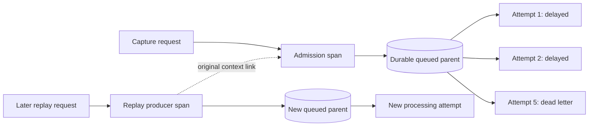

# Session 22: follow work across a process boundary

Story: SR-17. Read [admission identity](16-admission-identity-and-receipts.md) and [worker ownership](17-retries-and-worker-ownership.md) first. The [verification record](verification.md) distinguishes implemented instrumentation from executed checks.

## Start with a concrete debugging problem

You send a capture request and receive 202. Five seconds later, an event is still absent from the chart. The HTTP request already ended. A background worker has retried the queued row in several fresh database contexts. Searching only the HTTP request log cannot explain those later attempts.

The response now includes `X-Trace-Id`. Admission stores a validated W3C parent context beside the queue payload. Each processing attempt starts a new span using that stored parent. Its structured log includes trace ID, span ID, outcome, attempt number, and queue sequence. The diagnostic context survives process restart because it crosses the boundary in database columns.

The event's raw properties and distinct ID do not become trace tags or persisted trace metadata. The stored parent is a fixed-format identifier, not a copy of a header collection. Baggage is not copied. The context grants no authority: capture still needs its write key, replay still needs its project role, and processing still needs a current lease.

## Explain it three ways

**As a journey:** the trace ID names one execution journey. A span names one step on that journey. The admission span and its worker attempts belong to the same journey even though they happen at different times. A replay request begins a later journey and links back to the original one.

**As a family diagram:** an attempt has a parent, the producer span recorded at admission. Two retry attempts are siblings, not the same person wearing the same name. A replay links to its earlier family while belonging to the replay request's own parent tree. A link preserves a relationship without pretending the first request remained open forever.

**As stored fields:** `TraceParent` is the current producer's trace/span/flags. `OriginalTraceParent` is optional and records the original context for replay links. Both are nullable for old rows and bounded to the W3C version-zero shape. The worker parses them with `ActivityContext.TryParse`. Invalid or oversized context produces a new local diagnostic context; it does not turn otherwise valid business data into a dead letter.

Read the diagram from left to right once. Then trace the arrows backward from successful processing: which context is its parent, and which context is only a link? Drawing that distinction yourself is more useful than memorizing tracing vocabulary.

## Three records that should not be confused

| Record | Question it answers | What absence means |
| --- | --- | --- |
| Trace/span | Which execution steps happened, and how are they related? | Sampling or diagnostic loss may have omitted evidence |
| Processing receipt | What is the durable outcome of each accepted processing obligation? | Check the documented receipt lifetime and admission contract |
| Audit entry | Who performed a supported authorized management change? | Inspect the operation's audit contract; do not infer actors from a trace |

A trace ID is not an idempotency key. Reusing it must not deduplicate two events. A span ID is not a lease owner. Possessing it cannot authorize a worker to commit. A trace can be missing while the receipt and event commit correctly. These are separate invariants with separate storage and tests.

## Follow the implementation in small steps

1. Open [IngestionTrace.cs](../../src/Pulse.Infrastructure/Services/IngestionTrace.cs). Find the named `ActivitySource`, parent parser, serializer, producer, consumer, and log method. Make a list of every persisted or logged diagnostic field. There should be no event property or identity field.
2. Open [RequestLoggingMiddleware.cs](../../src/Pulse.Api/RequestLoggingMiddleware.cs). Find capture correlation creation before the downstream middleware. That placement lets authentication, validation, and rate-limit responses still carry a useful capture trace ID. Request logs use route templates so route parameter values are not copied into these structured path fields.
3. In [QueueAdmissionService.cs](../../src/Pulse.Infrastructure/Services/QueueAdmissionService.cs), locate the admission activity and queue row creation. All newly admitted items in one batch share a producer context. Duplicate admissions are counted diagnostically; they do not create extra processing rows.
4. In [IngestionProcessor.cs](../../src/Pulse.Infrastructure/Services/IngestionProcessor.cs), separate the diagnostic wrapper from `ProcessLeasedRowCoreAsync`. The core still owns business validation, retry decisions, and fenced transactions. The wrapper starts and disposes one span for each invocation and records a bounded outcome.
5. Find the dead-letter construction in the same file. Trace context is normalized again before being retained. Then read [IngestionOperationsService.cs](../../src/Pulse.Infrastructure/Services/IngestionOperationsService.cs): replay creates a producer in the current request's trace and preserves one original-context link.
6. Open [IngestionTraceTests.cs](../../tests/Pulse.Tests/Infrastructure/IngestionTraceTests.cs) and [IngestionTraceApiTests.cs](../../tests/Pulse.Tests/Api/IngestionTraceApiTests.cs). Match each assertion to the arrows in your diagram.

## Why a missing collector cannot stop capture

`ActivitySource.StartActivity` may return null when there is no listener or the sampling decision is to collect nothing. That is normal operation. The helper then creates a local W3C activity so local log correlation remains available. It does not contact an external service.

The repository does not install an external telemetry exporter by default. A deployment can later attach a listener/exporter to the `Pulse.Ingestion` source. That integration must preserve these data boundaries and tolerate unavailable telemetry delivery. The current implementation's business transactions have no collector dependency.

Think of sampling as deciding how much diagnostic evidence to retain, not deciding which events deserve processing. In a code review, search for conditions such as `if (activity != null) SaveChanges()`. That would incorrectly couple business correctness to observability.

## The failure-and-replay experiment

Use only the private test database. The test first admits the same client event ID twice in a batch. Predict the queue row count and processing span count before running it: one queue row, then one span per actual attempt. Repeated admission alone creates no second processing attempt.

The test injects recognized SQLite contention while saving analytics events. It advances the controlled clock to each recorded retry time and opens a new context for every attempt. After the fifth failure, it inspects the dead letter's parent context. All five spans should share the original trace but have different span IDs.

Next, a separate replay request queues the same valid payload with a new producer parent and an original-context link. Successful processing follows that new parent. Draw the expected parent and link IDs before inspecting the listener's captured activities. If you accidentally set replay's parent to the original failed producer, explain why the replay request disappears from the causal tree.

Finally, search the captured tags and structured ingestion logs for the test's distinctive fake secret markers. Finding the correct trace ID is only half the test; not copying payload secrets into diagnostic fields is the other half.

## Exercises that build ownership

1. Temporarily corrupt only a stored trace parent in a disposable fixture. Predict event/receipt results. They must remain correct. Explain why invalid business JSON and invalid diagnostic context have different consequences.
2. Disable sampling. Capture and process a row. Check that safe local correlation still has a nonzero trace ID and distinct span IDs. Do not equate “not exported” with “not processed.”
3. Add one diagnostic field in a practice branch. Decide its maximum size, cardinality, source, and whether it can contain customer input before writing the code. Prefer a finite outcome code over an arbitrary exception message.
4. Imagine a replay of a replay. Trace which parent is current and which original link is retained. Explain why the implementation keeps one bounded original context instead of an ever-growing history in each queue row.

## Return to this next week

Without opening the files, explain how one accepted event can have one receipt item, five worker spans, and a later replay trace. Then find the code that makes each number true. A midlevel engineer follows the request across layers; a senior engineer also checks whether diagnostics can lie, expose data, or accidentally change the transaction's outcome.
