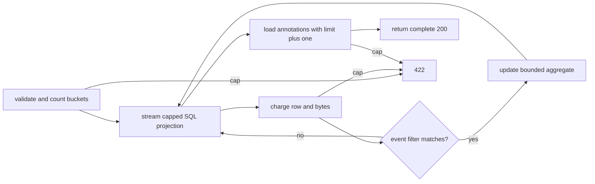

# Lesson 23: a complete answer needs a bounded proof

Story: SR-18. Start with [comparing analytics](07-comparing-analytics.md). This lesson describes the implementation; the [verification record](verification.md) says what has actually run.

## What you are learning

A chart with 20 points can still require reading ten million events. Limiting the response therefore does not limit the work. The bounded trend route makes a stronger promise: it returns a complete chart only after every relevant input and annotation fits known budgets. Otherwise it returns a reason and asks the caller to narrow the question.

The fixed limits are 10,000 scanned events, 8 MiB of projected property JSON, 2,161 buckets, 1,000 annotations, a 90-day range, and a cooperative two-second server deadline. These are independent dimensions. Passing one says nothing about the others.

## Follow one request

`GET /api/projects/P/insights/trend-bounded?event=view&from=2026-05-01T00:00:00Z&to=2026-05-01T02:00:00Z&interval=hour` first authorizes read access and validates an explicit, nonempty range. It computes three inclusive bucket starts before opening the event stream. The SQL query constrains project, event, and inclusive timestamps and orders by timestamp then ID.

Without filters the projection contains only ID, PersonId, and timestamp. With an event-property filter it also contains property JSON. Each row is charged before the filter is evaluated. This order matters: 10,001 scanned events that yield one match are still over budget. A selective predicate in application memory cannot make the database and provider work disappear.

The service holds only bucket counters and a distinct-PersonId set per bucket. It then loads at most 1,001 annotations. Only after all checks pass does the endpoint create a 200 response. A cap failure becomes 422 with `row_limit`, `byte_limit`, `bucket_limit`, or `annotation_limit` and narrowing guidance.

## Compatibility is a feature

The old trend route treats both endpoints as inclusive and zero-fills every bucket touched by that range. It also applies `Distinct()` to nullable PersonId values, so several events with no PersonId contribute one unique value in a bucket. The bounded route deliberately reproduces that surprising null rule. Changing a metric while changing its execution strategy would make comparison impossible.

At 10:00 two `view` events have null PersonId. The 10:00 bucket has count 2 and uniquePersons 1. If the range ends at 11:00, an empty 11:00 bucket is present because the boundary is inclusive. [BoundedQueryService.cs](../../src/Pulse.Infrastructure/Services/BoundedQueryService.cs) contains the aggregate; [QueryService.cs](../../src/Pulse.Infrastructure/Services/QueryService.cs) is the compatibility reference.

## Cancellation has two owners

The request cancellation token means the client went away. A linked token also fires after two seconds. The database provider observes the same cooperative signal, but cleanup can take longer than two wall-clock seconds. When the linked deadline fired and the client token did not, the service throws a deadline-specific exception and HTTP maps it to 504. When the client token fired, cancellation remains cancellation; it is not relabeled as a server failure.

This distinction matters operationally. A 504 says the server declined to finish within its policy. Client cancellation says the caller stopped waiting. Combining them would produce misleading reliability data.

## Walk the files

1. Read [QueryWorkBudget.cs](../../src/Pulse.Domain/QueryWorkBudget.cs). For each mutator, write the exact allowed boundary and the first rejected value.
2. Read [BoundedQueryService.cs](../../src/Pulse.Infrastructure/Services/BoundedQueryService.cs). Circle the SQL predicates and projection. Underline where charging happens relative to filtering.
3. Read [BoundedAnalyticsEndpoints.cs](../../src/Pulse.Api/Endpoints/BoundedAnalyticsEndpoints.cs). Separate 400 validation, 422 capacity, 504 deadline, and client cancellation.
4. Compare bucket construction with [TimeBucket.cs](../../src/Pulse.Domain/TimeBucket.cs) and the old query service.
5. Match [QueryBudgetPolicyTests.cs](../../tests/Pulse.Tests/Domain/QueryBudgetPolicyTests.cs) and [BoundedTrendTests.cs](../../tests/Pulse.Tests/Api/BoundedTrendTests.cs) to the contract.

## Practical boundaries

Streaming bounds retained application state; it does not mean a provider allocates no row buffer. One oversized JSON value can be materialized before its UTF-8 byte count is checked. The deadline is cooperative. Distinct-person sets can contain up to the row limit across buckets. The old endpoints remain unbounded. These statements define what the feature actually controls.

## Observed resource rehearsal

The warmed comparison in `final-features-expanded.trx` produced these observations on one test run:

| Rows | Bounded allocated bytes | Bounded elapsed | Legacy allocated bytes | Legacy elapsed |
| ---: | ---: | ---: | ---: | ---: |
| 10 | 141,808 | 5 ms | 53,896 | 2 ms |
| 100 | 150,840 | 3 ms | 109,928 | 2 ms |
| 1,000 | 812,752 | 10 ms | 775,984 | 6 ms |

For these small fixtures, the bounded path used more measured allocation and took longer. This run does not establish a speedup. The allocated-byte values are process-wide deltas, can include test-runner and concurrent runtime noise, and do not measure retained memory.

The demonstrated benefit is the enforceable ceiling and complete-result rule: SQL reads at most the row cap plus one, projected property bytes and annotations are counted, aggregate dimensions are capped, and deadline excess cannot become a partial successful chart. Those guarantees limit worst-case request work even when their accounting and cancellation checks add overhead to small queries.

## Experiments

1. Create exactly 10,000 matching rows and predict success. Add one and predict the reason code. Repeat with many nonmatching rows plus a selective event-property filter; explain why the scan still fails.
2. Request 90 days by hour, then change only the interval to day. Calculate the bucket counts on paper before calling either request. Try a timestamp near `DateTimeOffset.MaxValue` and confirm validation or budget handling does not overflow enumeration.
3. Compare the old and bounded route on tied timestamps, an empty middle bucket, two null PersonIds, and one known person. Write expected `(count, uniquePersons)` pairs first.
4. Use the controlled slow-query seam in the tests. Trigger client cancellation once and deadline cancellation once. Record which exception and HTTP response appear and whether a fresh context can query afterward.
5. Repeat the warmed 10/100/1,000-row rehearsal on an otherwise idle machine. Run it at least three times, keep every observation, and compare medians rather than selecting the fastest run. Then add a larger within-cap fixture. Explain separately what the measurements suggest about cost and what the fixed budgets prove about maximum accepted work.

For every experiment, write prediction, observation, explanation, and next question. The rehearsal test warms both query shapes and reports bounded and legacy elapsed time plus process-wide allocated-byte deltas at several input sizes. Those deltas include runtime or concurrently executing test work: they are observations for comparison, not retained-memory measurements or stable pass/fail thresholds. Resource observations belong beside correctness evidence because the story is about resource behavior.

## Teach back

Explain why `Take(10000)` followed by aggregation can lie. Then explain why 2,161 output buckets do not cap scanned rows, JSON parsing, or distinct-person memory. Finally, describe the one allocation the byte budget cannot prevent.
