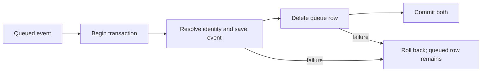

# Data modeling and transaction boundaries

**Outcome:** identify which database writes form one indivisible operation
and prove that a failure cannot leave half of that operation committed.

## Draw the invariant first

For a successful queued event: event storage, identity changes, registry
changes, and queue removal must commit together. If acknowledgement fails,
the queue row must remain and those writes must roll back.

An invariant is a condition that must remain true through every supported
path. "This method calls SaveChanges" is not an invariant. "A failed replay
cannot lose its original dead letter" is one.



## Why one SaveChanges was insufficient

Previously `CaptureService` committed the event, then the processor deleted
the queue row separately. A crash between them left a stored event and a
pending queue row. The next cycle could store another copy.

Now `IngestAndAcknowledgeAsync` owns the transaction for both operations.
Direct capture-service calls still use the same path without a queue
sequence. The dead-letter move also commits insertion and removal together.

EF's default transaction covers a single `SaveChanges` call; an explicit
transaction can cover several database operations. See
[EF transaction documentation](https://learn.microsoft.com/en-us/ef/core/saving/transactions).

## Track the other kind of state

The database can roll back while your `DbContext` still tracks modified
objects. Inspect `ChangeTracker.Clear()` on the retry path. The next write
must not accidentally flush remnants from the failed attempt.

Look at the identity service's local tracker checks. They help multiple
events within a batch see entities created before a save. Removing them
because they look redundant changes behavior.

## Exercise: break acknowledgement on purpose

Run:

```powershell
dotnet test --filter "FullyQualifiedName~IngestionTransactionTests"
```

The tests use a SQLite trigger to reject queue deletion. They check actual
stored events, persons, mappings, and definitions after rollback, then lift
the fault and verify a retry produces one event. This probes the precise
failure boundary; a mock asserting "Commit called" would not establish it.

**Try:** in an isolated test, move queue deletion after the commit. Predict
which assertion fails, run it, then restore the correct implementation.

## What this guarantee does not cover

Two separate `POST /capture` calls still produce two queue rows. A database
transaction does not deduplicate client retries. Multiple worker instances
also need a deliberate claiming or partitioning protocol. Replay appends at
the queue tail and cannot restore the original event-processing order.

**Done when:** you can label the commit point, describe the state after an
exception before and after it, and explain atomicity separately from
idempotency. Propose a unique event ID scoped by project as a future design,
including what should happen if the same ID has a different payload.
